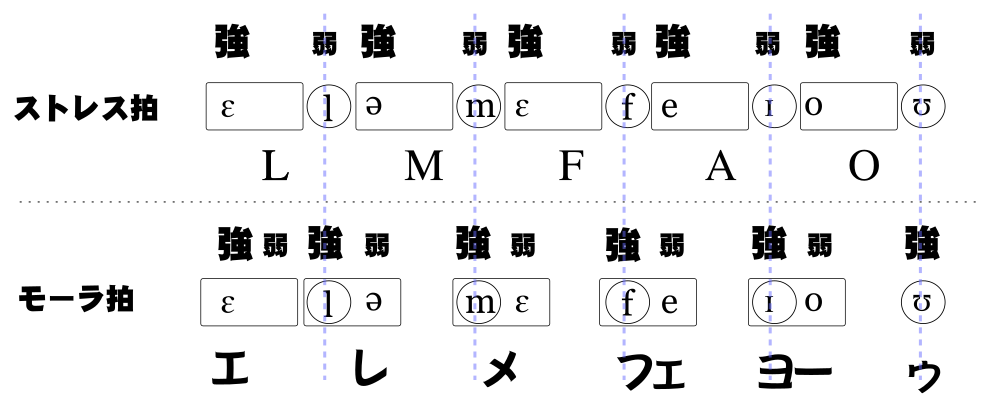
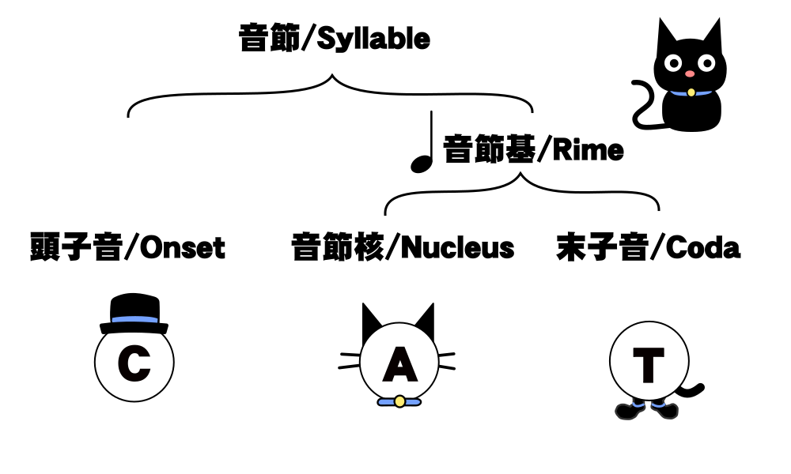
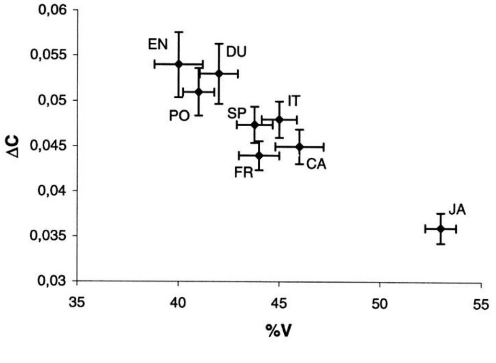
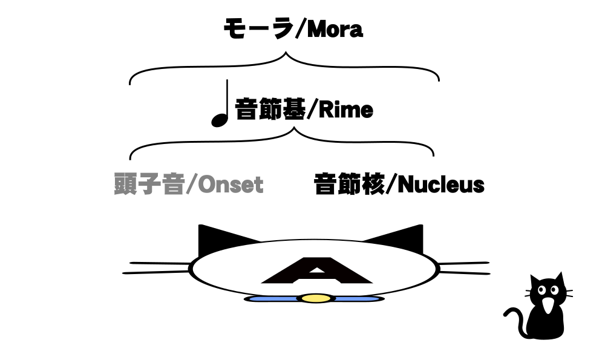
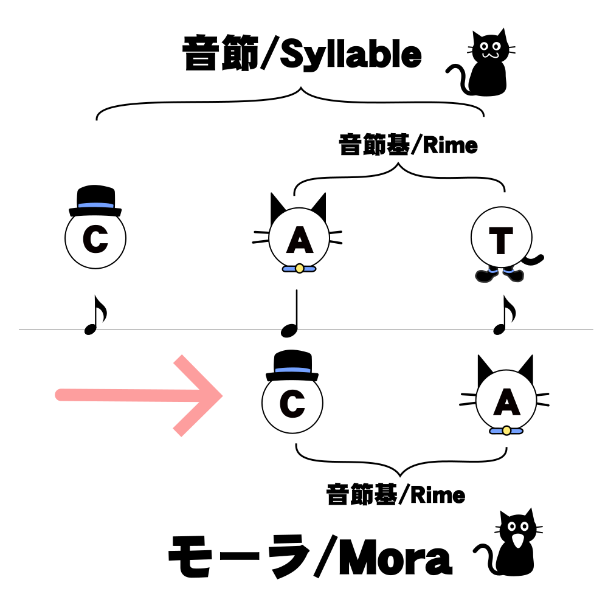

*※2025/06/16 11:16:35 更新*

## 日本人は何故英語が聴き取れないのか

日本人は英語が聴き取れません。日本人は英語がわかる様になるために義務教育で１０年以上の月日を費していますが日本人はほとんどの場合英語が理解できません。努力の末に英語を読むことが出来るようになっても、映画を字幕無しで見て理解したり、実際に会話したりすることは出来ません。そんな頭でっかちな英語教育が批判され、実践英会話の重要性が叫ばれたのももう２０年以上前の話ですが、２０年たった今も状況はほとんど変わっていません。

何故日本人は英語が苦手なのでしょうか ─── その原因こそが、日本人のリズムの認識が作り出す盲点＝縦乗りです。

縦乗りとは元々、日本のジャズ演奏者の間で使われていた俗語でした。ジャズ独特なスイング感のないグルーヴのない日本人のジャズの演奏は俗に『縦乗り』と呼ばれています。グルーヴ感はジャズの醍醐味です。グルーヴ感のないジャズは正に画竜点睛を欠いており聴く価値がありません。しかし日本人がグルーヴしない理由をはっきりと理解し明確に説明できた人は存在しませんでした。

日本人ジャズ演奏者の間で日本人のリズムの問題『縦乗り』は、深く心に傷を埋め込み、話題として出すだけで激昂する人が大勢存在する為、もはやタブーとしてみな腫れ物に触れるような扱いをしてきました ─── この**多次元弱拍基軸リズム理論** は、そんな状況を打破することを目的として生まれました。

ジャズ演奏の指針として生まれたこの**多次元弱拍基軸リズム理論**は、実は海外で研究されている音韻学で既に説明されていることと多くの共通要素があります。つまり少しもグルーヴしない日本人ジャズの縦乗り問題は、日本人が英語が聴き取れなくなる理由と非常に深い関連があります。

### 強拍弱拍の順番の違いとは

具体例として次のビデオを見てみます。

<blockquote class="twitter-tweet" data-media-max-width="560">
【リエゾン】前後の子音が全て繋がることをリエゾンといいます。  LMFAO エルエムエフエイオー ⇩⇩⇩⇩ エェレッメッフェィヨゥ！ Credit : <a href="https://t.co/FL5wMtgC4l">https://t.co/FL5wMtgC4l</a> <a href="https://t.co/v0mkyrsnW4">pic.twitter.com/v0mkyrsnW4</a>
&mdash; 岡敦/Ats🇯🇵 (@ats4u) <a href="https://twitter.com/ats4u/status/1596182037001830400?ref_src=twsrc%5Etfw">November 25, 2022</a></blockquote>

このビデオに登場するのは2011年前後に一世風靡したLMFAOというボーカルユニットです。彼らがストレス拍リズムで発音する「エルエムエフエイオー」が、モーラ拍リズムの認識では『エェレッメッフェイヨウ』と認識されます。

これはシラブル拍リズム・ストレス拍リズム言語での拍の順番＝弱強というリズム認識を、モーラ拍リズム言語での拍の順番＝強弱というリズム認識で間違って認識してしまうことから起こります。

上記はストレス拍解釈の発音をモーラ拍リズム解釈で解釈し間違えた時の状態を図式化したものです。

英語では母音にアクセントを置いており、子音をその前に添える様に発音します。これを音楽の強拍弱拍に喩えるならば、それはあたかも音楽の弱起と同じ要素があることに気付くでしょう。弱起を先に添える様に演奏し、その後で強拍を演奏することで、弾むようにリズミカルな雰囲気を醸造するのです。

海外の音韻学では、この様に出来る限り弱拍を先に演奏する傾向のことを **頭子音最大化原則（とうしおんさいだいかげんそく/Maximize Onset Principle / MOP )** と呼びます。 この頭子音最大化原則については今後の節でより詳しく見ていきます。

日本語では、子音にアクセントを置いてアクセントの後で母音を発音します。なのでシラブル拍での弱く発音する子音を聴いた時に次に更に大きな強拍が来ることが予想できず、そのまま子音を強拍として錯覚してしまう現象が起こります。これを[最初に聴いた音が１拍目強拍に聴こえる症候群](https://oka-ats.blogspot.com/2021/01/oka01-ubjkgrbexmeuwzjj.html) と呼びます。

[最初に聴いた音が１拍目強拍に聴こえる症候群](https://oka-ats.blogspot.com/2021/01/oka01-ubjkgrbexmeuwzjj.html)  によって日本人が英語を聞くと、単語の区切り位置が完全に１つずれた状態で頭の中で結像する結果となって観察されます。

## 音符の順番の認識の違い

### 強拍と弱拍とは
海外の音楽の音符には **強拍** と **弱拍** という概念があります。音符が２つ以上あった時に小節上に現れる奇数番目の音符を**強拍**と、そして小節上に現れる偶数番目の音符を**弱拍**と呼びます。つまり小節上に先頭から順番に強弱強弱という順番で現れます。

次に４分音符での強拍と弱拍の関係を説明します。

同じ様に８分音符にも強拍弱拍が存在します。

### 強拍と弱拍の順番

もし音が次のように2回鳴ったとすると、その音符をどのように譜面に配置するでしょうか。

<blockquote class="twitter-tweet" data-media-max-width="560">
この様に２つの音が連続して並んでいるリズムをスコッチスナップと呼びます。一説では英語の元となったゲール語に起源があり、ゲール語由来の英語の主要単語にしばしば見られるリズムです。body billy money nitty gritty bitter dinner uncle Philip 等々 <a href="https://twitter.com/hashtag/%E3%82%AA%E3%83%95%E3%83%93%E3%83%BC%E3%83%88%E3%81%A7%E6%80%9D%E8%80%83%E3%81%99%E3%82%8B%E8%AA%9E%E5%AD%A6?src=hash&amp;ref_src=twsrc%5Etfw">#オフビートで思考する語学</a> v2 <a href="https://t.co/LXyKij07J6">pic.twitter.com/LXyKij07J6</a>
&mdash; 岡敦/Ats🇯🇵 (@ats4u) <a href="https://twitter.com/ats4u/status/1938149704401043799?ref_src=twsrc%5Etfw">June 26, 2025</a></blockquote>

この時、二通りの配置のしかたがあります。

<blockquote class="twitter-tweet" data-media-max-width="560">
【音が２つ鳴った時のリズムの前後関係の認識の違い】 モーラ拍リズム（日本語）リズム認識では強拍の後ろに弱拍が追随していると認識する。（第二版） <a href="https://twitter.com/hashtag/%E3%82%AA%E3%83%95%E3%83%93%E3%83%BC%E3%83%88%E3%81%A7%E6%80%9D%E8%80%83%E3%81%99%E3%82%8B%E8%AA%9E%E5%AD%A6?src=hash&amp;ref_src=twsrc%5Etfw">#オフビートで思考する語学</a> <a href="https://t.co/beMyPDhY7L">pic.twitter.com/beMyPDhY7L</a>
&mdash; 岡敦/Ats🇯🇵 (@ats4u) <a href="https://twitter.com/ats4u/status/1931607875006427196?ref_src=twsrc%5Etfw">June 8, 2025</a></blockquote>

もしかするとこの配置が最も自然だと感じたかも知れません ───  しかし次の様に解釈することも可能です。

<blockquote class="twitter-tweet" data-media-max-width="560">
【音が２つ鳴った時のリズムの前後関係の認識の違い】 ストレス拍リズム（英語）のリズム認識では弱拍が強拍に先駆けているという順序認識になる。（第二版） <a href="https://twitter.com/hashtag/%E3%82%AA%E3%83%95%E3%83%93%E3%83%BC%E3%83%88%E3%81%A7%E6%80%9D%E8%80%83%E3%81%99%E3%82%8B%E8%AA%9E%E5%AD%A6?src=hash&amp;ref_src=twsrc%5Etfw">#オフビートで思考する語学</a> <a href="https://t.co/rPiPqopgN4">pic.twitter.com/rPiPqopgN4</a>
&mdash; 岡敦/Ats🇯🇵 (@ats4u) <a href="https://twitter.com/ats4u/status/1931608649400467488?ref_src=twsrc%5Etfw">June 8, 2025</a></blockquote>

この様に解釈しても決して間違いではありません。

これは2つの音が鳴った時に、どちらが**強拍**で、どちらが**弱拍**と認識するかという問題にまとめられます。

### 強拍先行＝強弱

<blockquote class="twitter-tweet" data-media-max-width="560">
【音が２つ鳴った時のリズムの前後関係の認識の違い】 モーラ拍リズム（日本語）リズム認識では強拍の後ろに弱拍が追随していると認識する。（第二版） <a href="https://twitter.com/hashtag/%E3%82%AA%E3%83%95%E3%83%93%E3%83%BC%E3%83%88%E3%81%A7%E6%80%9D%E8%80%83%E3%81%99%E3%82%8B%E8%AA%9E%E5%AD%A6?src=hash&amp;ref_src=twsrc%5Etfw">#オフビートで思考する語学</a> <a href="https://t.co/beMyPDhY7L">pic.twitter.com/beMyPDhY7L</a>
&mdash; 岡敦/Ats🇯🇵 (@ats4u) <a href="https://twitter.com/ats4u/status/1931607875006427196?ref_src=twsrc%5Etfw">June 8, 2025</a></blockquote>

この様に解釈した時、これは弱拍が強拍の後ろに配置されていると見ることが出来ます。この場合の順番は『**強弱**』です。

### 弱拍先行＝弱強

逆に

<blockquote class="twitter-tweet" data-media-max-width="560">
【音が２つ鳴った時のリズムの前後関係の認識の違い】 ストレス拍リズム（英語）のリズム認識では弱拍が強拍に先駆けているという順序認識になる。（第二版） <a href="https://twitter.com/hashtag/%E3%82%AA%E3%83%95%E3%83%93%E3%83%BC%E3%83%88%E3%81%A7%E6%80%9D%E8%80%83%E3%81%99%E3%82%8B%E8%AA%9E%E5%AD%A6?src=hash&amp;ref_src=twsrc%5Etfw">#オフビートで思考する語学</a> <a href="https://t.co/rPiPqopgN4">pic.twitter.com/rPiPqopgN4</a>
&mdash; 岡敦/Ats🇯🇵 (@ats4u) <a href="https://twitter.com/ats4u/status/1931608649400467488?ref_src=twsrc%5Etfw">June 8, 2025</a></blockquote>

この様に解釈した場合、これは弱拍が強拍よりも前に配置されている見ることが出来ます。この場合の順番は『**弱強**』です。

### 言語によって変わる拍の順番認識

この強弱・弱強という拍の順番の認識は、その人が母国語として話す言語に大きな影響を受けます。

#### 弱拍先行のシラブル拍リズム🇫🇷／ストレス拍リズム🇺🇸 

ストレス拍リズム（英語）を母国語とする人は、**強弱を自然と感じ弱強を不自然に感じる**という認識の偏りを持っていません。 彼らは **弱強と強弱の両方とも自然**に感じており、音楽にも『弱強』『強弱』の両方のパターンが現れます。

#### 強拍先行のモーラ拍リズム🇯🇵

しかしモーラ拍リズムを母国語とする人は、**強弱を自然と感じ弱強を不自然に感じる**という認識の偏りが起こります。また同様にして、モーラ拍リズムの言語で演奏される音楽の拍の順番には『強弱』のパターンしか現れません。日本に住み日本の音楽だけを聴いていると、このリズム認識の偏りに気付く機会がほとんどないため、この偏りは日本語話者の大半が全く気付くことなく、日本社会の大きな盲点となって社会のなかに隠然と存在し続けています。

─── 日本人は何故グルーヴしないのか。その理由がこれです。

 ─── 同時に、日本人が英語が聴き取れない理由も、これです。

この強拍先行のリズム認識がモーラ拍リズムの特徴であり、同時に言語にはない特殊な特徴でもあります。

## 拍リズム＝言語が持っているリズム認識

日本人が演奏する音楽のリズムは、海外の人が演奏する音楽と比べて何かが違います。この違いは、海外の人々が弱拍が強拍の前に来ていると認識している事に対し、日本人は強拍が弱拍の前に来ていると認識している事が原因として起こります。この認識の違いは言語自体が持っているリズム認識の違いから生まれます。このリズム認識の事を音韻学(Phonetics)で**拍リズム**(timed-rhythm)と呼びます。

### ３種類の拍リズム

日本語のリズム認識を音韻学で**モーラ拍リズム**(mora-timed rhythm) と呼びます。そして英語が持っているリズム認識を音韻学では**ストレス拍リズム**(stress-timed rhythm)と呼びます。この他にスペイン語・フランス語などが持っているリズム認識を音韻学では**シラブル拍リズム(syllable-timed rhythm)** と呼びます。 

**シラブル拍リズム**（英語）と**シラブル拍リズム**（スペイン語）の多くの特徴は共通です。一方**モーラ拍リズム**（日本語）はストレス拍リズムともシラブル拍リズムとも全く異なる、世界的に見て独特な特徴を持っています。特に日本語は、純粋なモーラ拍リズムを持っている言語として知られています。

| ストレス拍  | シラブル拍 | モーラ拍   |
| ------ | ----- | ------ |
| 英語     | スペイン語 | 日本語    |
| ドイツ語   | イタリア語 | キリバス語  |
| ロシア語   | フランス語 | スロバキア語 |
| オランダ語  | 韓国語   | ルガンダ語  |
| ポーランド語 | 広東語   | タミル語   |
| アラビア語  | トルコ語  |        |
| タイ語    | 北京語   |        |
| ラオ語    | テルグ語  |        |
| ノルウェー語 |       |        |

### モーラ拍リズム🇯🇵の特徴
モーラと呼ばれる時間単位で発音が構成されていることがモーラ拍リズムの特徴です。各モーラはほとんど同じ長さで発音されます。モーラは次で述べるシラブルとほとんど同じですが、末子音や多重子音がないことが特徴です。二重子音・末子音が必要なときは、それぞれの子音にモーラ割り当てるという特徴があります。 詳しくは後述します。

### シラブル拍リズム🇫🇷の特徴
シラブルと呼ばれる時間単位で発音が構成されていることがシラブル拍リズムの特徴です。各シラブルはほとんど同じ長さで発音されます。シラブルは前節で述べたモーラとほとんど同じ時間単位ですが、１つのシラブル内に多重子音・多重母音・末子音が現れることが特徴です。またリエゾンと言って、末子音が次のシラブルにつながることが特徴になっています。詳しくは後述します。

### ストレス拍リズム🇺🇸の特徴
ほとんどの特徴はシラブル拍リズムと共通です。シラブル拍との大きな違いは、シラブルが「強拍・弱拍」に分かれており、一定の時間毎に強拍を配置し、強拍ではないすべての弱拍は強拍の 間に適切に分散されたり、省略されたり、完全に脱落したりします。この弱拍の省略が起こることがストレス拍リズムの大きな特徴です。詳しくは後述します。

### 何故日本人は英語が苦手なのか
日本人が英語が苦手な理由は、このリズム認識のギャップの大きさにあります。日本人がスペイン語やイタリア語などのシラブル拍リズムに基づいた言語を最初に学ぶならば、日本人はモーラとシラブルの違いを学ぶだけで目的を達することができた筈です。しかし日本人が英語を学ぶ際は、シラブル拍が身についていない状態で、ストレス拍のシラブルの脱落や省略まで同時に身につける必要に迫られます。これは理論的に見て、無理なことです。

ここで大切な事は、まずモーラ拍の独特な特徴があることに気付き、モーラ拍の違いを学び、その上でまずシラブル拍の基礎を学び、シラブル拍が充分に身についたところで初めて、ストレス拍のシラブル脱落と省略を学ぶ必要があるのです。

シラブル拍という段階を経ずに一足飛びにストレス拍を習得する ─── この難しさが英語の習得の難しさの根源にあります。

## 言語によって異なるリズム認識
日本語のリズム認識のことを学術的に**モーラ拍リズム**と呼びます。世界的に見てモーラ拍リズムを持った言語は日本語しかありません。一方英語のリズム認識のことを学術的に**ストレス拍リズム**と呼びます。ストレス拍リズムの言語は英語だけではなく、ロシア語やドイツ語など世界的に見ると英語以外にもたくさん存在します。

### シラブル拍リズムについて

**シラブル拍リズム** （syllable-timed rhythm）とは、各シラブル（音節）がほぼ一定の長さで均等に発音される言語のリズムのことを指します。代表的なシラブル拍リズム言語としては、スペイン語、イタリア語、フランス語、タイ語などが挙げられます。  以下でこのシラブルの仕組みについて見ていきましょう。

#### 音節／シラブルとは

シラブル／音節とは音韻学の重要な概念のひとつです。全ての単語は、シラブルの組み合わせで構成されています。

#### シラブルの構造
全てのシラブルは、**頭子音(Onset)** **音節核(Nucleus)** **末子音(Coda)** の３つの要素で構成されています。 

音節核と末子音は、シラブルの本体になっています。この本体を **音節基(Rime)** と呼びます。 

#### シラブルの頭子音はなくならない

単語 **Cat** の頭子音は **C** です。**C** がなくなると **At** という位置を表す前置詞になります。 この場合このシラブルには頭子音がありません。英語では、このように頭子音がそこにない時でもしばしばそこに **声門閉鎖音** という特殊な子音が挿入されます。 このことを**声門閉鎖音挿入(Glottal Stop Insertion)**  と呼びます。

ネイティブ話者がほとんど声門閉鎖音挿入を意識していません。しかし日本人が、英語やスペイン語などのシラブル拍リズムやストレス拍リズムの言語を学ぶ場合、この**声門閉鎖音挿入をはっきり意識することはとても大切**です。これにはとても明快な理由があります。以下でその理由を見ていきましょう。

#### シラブルの音節基は等間隔で配置される
音節基は基本的に、等間隔で発音されます。音節基の間に子音が何個あっても音節基は必ず等間隔に発音します。

#### シラブルの頭子音と末子音は音節基の間に配置される
**頭子音** 及び **末子音** は、等間隔に並んでいる音節基と音節基の間に分散されます。頭子音と末子音の数が増えても音節基の間隔はかわりません。

#### シラブルの音節基に強拍が置かれる
読み上げの際は音節基に強拍が置かれます。

#### シラブルの頭子音と末子音に弱拍が置かれる。
音節基が強拍であることに対し **頭子音** 及び **末子音** は弱拍に対応します。

#### シラブルの末子音は頭子音に融合する＝リンキング

２つの音節が連続する場合、先に現れた音節の末子音は、可能な限り次の音節の頭子音としてまとめられて発音されます。このまとめる作業のことを**再音節化**・**再シラブル化** と呼びます。そしてこの末子音が頭子音にまとめられて発音される現象を**リンキング**と呼びます。**リンキングは英語の発音を学ぶうえで最も重要**と言っても過言ではない規則です。

#### シラブルには頭子音最大化原則＝MOPがある
リンキングは、可能であれば可能な限り起こるという規則があります。このことを**頭子音最大化原則（とうしおんさいだいかげんそく）**、または英語表記「Maximize Onset Principle」の頭文字をとって**MOP原則**と呼びます。

この図中で帽子が頭子音、猫が音節核、靴が末子音を表しています。

この図中の様に全ての末子音は出来るだけ次の頭子音に結びついてまとめて発音されます。これがリンキングです。

### モーラ拍リズムについて

日本語のリズムは、学術的に **モーラ拍リズム** に分類されています。モーラ拍リズムは、**シラブル**音節ではなく**モーラ**音節という特殊な単位で発音すると定義されています。この**モーラ**音節の構造を**シラブル**音節と比較すると多くの根本的な違いがあります。 日本語のモーラ拍リズムには主に以下のような特徴があります。

* 発音が一定時間ごとに区切れておりこの1音をモーラと呼ぶ。
* モーラは主に母音と子音で構成され末子音を持たない。

以下でモーラ音節とシラブル音節の違いを見ていきます。

#### モーラには末子音がない
モーラ音節をシラブル音節と比較した時の最大の違いは、末子音がないことです。モーラ音節には末子音がない ─── これがモーラ拍リズムの最大の特徴です。モーラ音節に末子音がないことが発端となってモーラ音節にはシラブル音節とは全く違った性質が生み出されます。以下で見ていきます。

#### モーラの頭子音は音節基に含まれる
シラブル音節では音節基に頭子音は含まれません。しかしモーラ音節では音節基に頭子音が含まれます。これがモーラ音節の2つ目の大きな特徴です。

#### モーラと音節基は同じ長さで区別がない

シラブル音節では、頭子音と音節核はそれぞれ独立していますが、モーラ音節では、音節核に頭子音が含まれ、かつ末子音がない為、結果として音節核と音節が同じ長さになり区別がなくなります。

#### モーラの頭子音はとても短い

日本語（モーラ拍）の子音は、シラブル拍ストレス拍の言語の子音の長さと比較して非常に短いという特徴があります。

これは母音優位な言語である日本語だけを話しているとほとんど意識できないことですが、一般的に日本語以外の言語では子音は母音と同じくらい長いものです。

これは米国政治家トランプ氏の有名な写真です。彼が正に今 **頭子音 F** を長く発音することでFで始まる単語を言おうとしていることがわかる写真です。この様に英語やその他の言語では**子音は長く発音する**ことができます。 ─── これは日本語がフを長く言おうとすると「ふううーーー」となってしまい**母音「う」** しか残らないことと対照的です。

引用：[言語と音楽のリズム的共通性：ジャズおよびブルーグラス奏者を対象とした事例研究 — ウディ・ワールサガー修士論文](https://www.academia.edu/50961691/Rhythmic_Similarities_between_Language_and_Music_Jazz_and_Bluegrass_Musicians_as_a_Case_Study_Udi_Wahrsagers_Thesis?utm_source=chatgpt.com) この論文は『言語と音楽のリズム的類似性』というタイトルの修士論文で、ジャズとブルーグラスの演奏家を比較対象にしています。（著：ウディ・ワールサガー）

このグラフは、**縦軸=AC**が平均的な子音の長さ、**横軸=%V**が母音の長さの平均的パーセンテージを表しています。ここから日本語だけが突出して長い母音を持っており、突出して短い子音を持っていることがわかります。特に母音の長さが50%を超えている言語は、８カ国語中１カ国JA=日本語だけということがはっきり見て取れます。

#### モーラの頭子音はなくなる
シラブル音節では、頭子音が音節核と独立しており、かつ音節核に音節基が置かれている為、**頭子音がなくなっても音節核の位置は変わりません。**  しかしモーラ音節では、頭子音が音節基に含まれている為、**頭子音がなくなると音節基がその分拡張します。** これがモーラ拍リズムの3番目の特徴です。

#### モーラとシラブルの違いは強拍と弱拍の前後関係の違い

モーラ拍とシラブル拍の違いは、頭子音（弱拍）が音節基（強拍）よりも前にあるか、後ろにあるかに集約されます。

**シラブル拍リズム言語を話す人は、一定間隔でやってくる強拍（音節基）を聴く前に弱拍（頭子音）を認識**しています。

対して**モーラ拍リズム言語を話す人は、一定間隔でやってくる強拍（音節基）を聴いた後に弱拍（頭子音）を認識**しています。

このシラブル拍リズム言語が持っている強拍よりも前に弱拍があるという感覚は、強拍よりも後ろに弱拍があると認識しているモーラ拍リズムの言語を話している人にとって、大変に不可解でつかみにくい感覚です。

これをモーラ拍リズム言語を第一言語として話す人が、第二言語としてシラブル拍リズム言語のリズムを訓練によって習得しようとすると、しばしば１０年、場合によっては２０年近い年月が掛かることも稀ではありません。

オフビートカウント理論は、このモーラ拍リズムを母国語とする人が、シラブル拍リズムや次に紹介するストレス拍リズムを第二言語として習得する為にどのようにしたら最も効率よく習得することが出来るかに着目し考察した結果として生まれた練習方法です。

### ストレス拍リズムについて
ストレス拍リズム（stress-timed rhythm）は、シラブル拍リズム（syllable-timed rhythm）から分岐して発展したと考えられているリズム認識の形式です。基本的な性質はストレス拍リズムと共通ですが、シラブル拍リズムにはないいくつかの大きな違いがあります。どちらのリズムも発音に一定のリズム感を作り出す為の拍を持っていますが、その拍の置き方に大きな違いがあります。

#### ストレス拍リズムとシラブル拍リズムの違い

前節で見た様に、シラブル拍リズムは、**全てのシラブルが基本的に等間隔に置かれる**というルールが存在します。しかしストレス拍リズムでは、シラブルの中でも **強勢拍(ストレス拍)** のある音節だけが一定の時間間隔で配置されまる。 それ以外のシラブルは**弱勢拍(無ストレス拍)** と呼ばれ、短く発音されます。

この**ストレス拍リズムの弱勢拍の省略こそがシラブル拍リズムとの大きな違いになっており、ストレス拍リズムの大きな特徴** になっています。

シラブル拍リズムでは各音節（シラブル）がほぼ同じ時間幅で発音される傾向があり、全体として均等なテンポで進むような印象を与えます。この形式では、音節ごとの長さにあまりばらつきがないため、機械的で平坦なリズムに聞こえることが特徴です。スペイン語やフランス語などがこのリズムに該当するとされており、各音節の存在が等しく扱われる点が特徴です。

ストレス拍リズムは、このシラブル拍リズムからの発展形として、より情報の圧縮やテンポの柔軟性を可能にした構造と見ることができます。つまり、強調すべき箇所（＝強勢音節）に時間的な主軸を置くことによって、より複雑なイントネーションや抑揚、リズムのグルーヴ感を作り出すことができます。このストレス拍リズムの構造は、音声と意味の強調関係に複雑な奥行きを与え、これが詩や歌の表現に大きな影響を与えています。

ストレス拍リズムの特徴には次のようなものがあります。

* 一定の時間毎に**強勢拍（ストレス拍）**が置かれる。
* ストレス拍の隙間を埋めるように複数の**弱勢拍（無ストレス拍）** を分配する。
* 強拍は必ず母音。
* 子音は必ず弱拍。
* 弱拍は子音と母音の両方がある。
* 母音は強拍と弱拍の両方がある。

#### モーラ拍リズムとストレス拍リズムの違い

前節で見た様にシラブル拍リズムとストレス拍リズムは、基本的に共通ですが、ストレス拍リズムには、シラブル拍リズムにはない特徴があります。つまり日本語のモーラ拍リズムから英語のストレス拍リズムを見ると、シラブル拍リズムの特徴とストレス拍リズムの特徴の両方の違いが、同時に混在している様に見えます。これが日本人が英語を理解することが難しくなる理由の１つです。

もし日本人が英語を最初に勉強するのではなく、スペイン語を最初に勉強していたならば、恐らく日本人は英語ほどの混乱はなくスペイン語を習得できた筈です。日本人が英語を学習するときは、モーラ拍リズムとシラブル拍の違いをしっかり学んで、シラブル拍リズムをきちんと身につけるだけでよかった筈です。

しかし日本人が英語の勉強をする場合、シラブル拍リズムの応用変化系であるストレス拍リズムの特徴を一気に学ぶ必要があります。日本人の英語学習者は、シラブル拍リズムをしっかり身につける間もなく、シラブル拍リズムの応用版であるストレス拍リズムを一気に同時に習得する必要があります。これは原理的にとても困難なことです。

#### ストレス拍リズムの特徴

以下は英語吹き替え版アキラの一幕です。

<blockquote class="twitter-tweet">
【縦乗りの起源】頭にアクセントが置かれる日本語の名前を英語ネイティブの人たちが読むと、しばしば2つ目の位置にアクセントが移動しますが、逆もまた然りです。  しばしば2番め以降にアクセントが置かれる英語のリズムを日本話ネイティブの人が読むと全アクセントが頭に移動します。  【英語版アキラ <a href="https://t.co/fJHnZgu5cb">pic.twitter.com/fJHnZgu5cb</a>
&mdash; 岡敦/Ats🇯🇵 (@ats4u) <a href="https://twitter.com/ats4u/status/1574375878184042496?ref_src=twsrc%5Etfw">September 26, 2022</a></blockquote>

ストレス拍リズムでは、アクセントが置かれたシラブル（モーラ）を他のシラブル（モーラ）よりも長く発音するというルールがあります。このため「タカシ」は「タカーシ」「アキラ」は「アキーラ」に変化します。一方タカシのタは弱拍にある為、軽く添える様に短く「ﾀｯカーーーｼ」とシラブル長が短くなる傾向があります。場合によってはこのシラブルは脱落し発音しないこともあります。これがストレス拍リズムの大きな特徴です。

<blockquote class="twitter-tweet" data-media-max-width="560">
縦乗りと横乗りの違いを完全に把握した。縦乗り解釈する時に音符の位置がずれる。これがいわゆる『日本人の頭重心リズム』のメカニズムだ。  縦乗り（モーラ拍リズム） 横乗り（ストレス拍リズム）<a href="https://twitter.com/hashtag/%E3%82%AA%E3%83%95%E3%83%93%E3%83%BC%E3%83%88%E3%81%A7%E6%80%9D%E8%80%83%E3%81%99%E3%82%8B%E8%AA%9E%E5%AD%A6?src=hash&amp;ref_src=twsrc%5Etfw">#オフビートで思考する語学</a> <a href="https://t.co/o3RILE8EMy">pic.twitter.com/o3RILE8EMy</a>
&mdash; 岡敦/Ats🇯🇵 (@ats4u) <a href="https://twitter.com/ats4u/status/1930932283294544307?ref_src=twsrc%5Etfw">June 6, 2025</a></blockquote>

モーラ拍（日本語）とストレス拍（英語）のリズムの違いは、アメリカ人が日本語を話した時によくなる英語訛り「ワターシワァ？ ニーホンｸﾞゴォウゥオォ？ ハナァシマスゥ！」という話し方に端的に現れています。アメリカ人は、ストレス拍を基準に非ストレス拍を短く揃える様に発音する習慣を持っている為、全ての拍を均等に揃えることが出来ません。

逆もまた然りです。日本人が英語を話すときになる「アーイ、スゥピィークゥ、イィンーグゥリーシュー」というような日本語訛りに端的に現れるでしょう。本来であればストレス拍と非ストレス拍の区分をはっきりさせて、ストレス拍の位置を定期的に配置しなければならないところを、全ての拍を均等に同じ長さで発音する習慣を持っているために、ストレス拍及び非ストレス拍の区別をつけることが出来ません。

モーラ拍（日本語）とストレス拍（英語）の違いを短くまとめると次のようになります。

* モーラ拍は、子音が必ずモーラの中に入っている。
* ストレス拍は、子音が必ず「モーラ（アクセント）」の前にある。

そして更に踏み込んで調べてみますと、次の様な認識の違いが存在することがわかります。

* モーラ拍は、子音と母音を区別しない。
    * ストレス拍（英語）には連続する複雑な子音クラスターがたくさん現れるため、いつも子音の位置を意識して発音しますが、モーラ拍（日本語）は子音が短く単純な為、ほとんどの場合その子音の位置を意識しません。
* モーラ拍は、末子音がない
    * ストレス拍は子音だけ単独で発音することが出来るため、当然音節（シラブル）の末尾に子音が来ることは稀ではありません。しかしモーラ拍（日本語）では、外来語で現れる末子音にも、その子音だけで独立した1モーラを割り当てます。つまりモーラ拍では末子音が存在することが出来ないのです。
* モーラ拍は、多重子音がない
    * 多重子音にはそれぞれの子音に母音をつけ1モーラが割り当てる。
* モーラ拍は、子音が短い
    * → 母音とモーラが主体で子音は重要ではない。
    * → 子音数が少ない。
* モーラ拍は、母音しか意識しておらず子音が意識できない
    * → 母音とモーラが主体で子音は重要ではない。
    * → 子音数が少ない。

|          | モーラ拍 | ストレス拍 |
| -------- | :--: | :---: |
| 子音と母音を区別 |  ない  |  ある   |
| 末子音      |  ない  |  ある   |
| 多重子音     |  ない  |  ある   |
| 子音       |  短い  |  長い   |
| 子音を意識    | しない  |  する   |

### 強拍先行は存在しない

『強弱』の様に聴こえるリズムでも、そこに隠れた暗黙の弱拍を演奏してから強拍を演奏します。海外の音楽には強拍先行は存在しません。一瞥すると強拍が先行する様に見えるリズムでも、実はその前に休符として先に弱拍を演奏する習慣があります。

### リズム解釈の違い
この言語自体が持っているリズム認識の違いは、同じ単語の発音の解釈の違いとして現れます。

| 拍リズム          | バナナ                     | コンピューター           | チョコレート         | カメラ        |
| :------------ | :---------------------- | ----------------- | -------------- | ---------- |
| モーラ拍 🇯🇵     | /**ba**-**na**-**na** / | /ko-m-pyu-u-ta-a/ | /cho-ko-re-to/ | /ka-me-ra/ |
| シラブル拍🇪🇸🇫🇷 | /**ba**-**na**-**na** / | /com-pyu-ter/     | /cho-co-late/  | /ca-me-ra/ |
| ストレス拍🇺🇸🇬🇧 | /ba-**NA**-**na** /     | /kəm-ˈPYU-ter/    | /ˈCHOK-lət/    | /KAM-ruh/  |

このリズム解釈の違いは、言語だけでなく、音楽での強拍と弱拍の前後関係の違いとして現れます。この認識の違いは、即興演奏時や作曲時の無意識の音符の配置の仕方にはっきりとした偏りを生み出します。そしてこの認識の違いは、音楽だけにとどまらず日常的に行う動作と動きの認識、行動全体に対して大きな影響を与えています。

 特にこのリズム認識の違いは、無意識の内に音楽を演奏する時の強拍弱拍の順番の違いとして現れます。

### 強拍弱拍は単独では存在しない
前述の通り強拍と弱拍が存在するためには、当たり前なことですが、最低でも２つ以上の音符が必要です。この事は特筆に値します。海外の音楽には必ず強拍弱拍があります。これは裏を返すと、単独の拍を単独で演奏することがほとんどないということを隠喩しています。 単独の拍を単独で演奏している様に見えても、演奏者及び聴者は、そこに暗黙の弱拍があることを聴き取っています。

しかし日本語のようなモーラ拍リズムの言語を母国語とする人は、しばしば音楽を演奏する時に音符を単独で演奏する習慣を持っています。ここから日本語話者は音符を聞いた時、そこに暗黙の弱拍があることは愚か、そこに強弱の区別がある事にすら気付かないという、日本語話者に独特な盲点が生まれます。

**強拍弱拍は単独では存在できなません。** そして海外の音楽では**単独の音符は存在しません。** このことをここで指摘すると共に今後常にこのことを喚起していく必要があるでしょう。

強拍でも弱拍でもない単独の音符が現れてしまう ─── これがモーラ拍リズム（日本語）話者が持っている１つ目の盲点です。

## 強弱リズム解釈の人は弱強リズムを聴き間違える

モーラ拍リズムを母語として話す人は、ストレス拍リズムを母語として話す人が演奏するリズムを強弱リズム解釈として１つずれた形で認識します。

<blockquote class="twitter-tweet" data-media-max-width="560">
バダムツー（英語での「ちゃんちゃん」のような効果音） Credit : <a href="https://t.co/1pMfDuY1S3">https://t.co/1pMfDuY1S3</a> <a href="https://t.co/qdcGm8P81M">pic.twitter.com/qdcGm8P81M</a>
&mdash; 岡敦/Ats🇯🇵 (@ats4u) <a href="https://twitter.com/ats4u/status/1928811162042507281?ref_src=twsrc%5Etfw">May 31, 2025</a></blockquote> 

### 弱強リズム解釈

ストレス拍リズム（英語）の話者は、バダムツーを聴いた時、4分音符で弱強で、8分音符で弱強で解釈します。

この解釈を音楽で表すと次のようになるでしょう。

<blockquote class="twitter-tweet" data-media-max-width="560">
バダムツーの横乗りでの解釈 <a href="https://twitter.com/hashtag/%E3%82%AA%E3%83%95%E3%83%93%E3%83%BC%E3%83%88%E3%81%A7%E6%80%9D%E8%80%83%E3%81%99%E3%82%8B%E8%AA%9E%E5%AD%A6?src=hash&amp;ref_src=twsrc%5Etfw">#オフビートで思考する語学</a> <a href="https://t.co/KN5gMaKMdE">https://t.co/KN5gMaKMdE</a> <a href="https://t.co/C5x0FYgXLk">pic.twitter.com/C5x0FYgXLk</a>
&mdash; 岡敦/Ats🇯🇵 (@ats4u) <a href="https://twitter.com/ats4u/status/1928070026998755806?ref_src=twsrc%5Etfw">May 29, 2025</a></blockquote>

### 強弱のリズム解釈

ところがモーラ拍リズム（日本語）の話者は、バダムツーを4分音符も強弱、8分音符も強弱で解釈します。

この解釈を音楽で表すと次のようになるでしょう。

<blockquote class="twitter-tweet" data-media-max-width="560">
バダムツーの縦乗りでの解釈 <a href="https://twitter.com/hashtag/%E3%82%AA%E3%83%95%E3%83%93%E3%83%BC%E3%83%88%E3%81%A7%E6%80%9D%E8%80%83%E3%81%99%E3%82%8B%E8%AA%9E%E5%AD%A6?src=hash&amp;ref_src=twsrc%5Etfw">#オフビートで思考する語学</a> <a href="https://t.co/KN5gMaKMdE">https://t.co/KN5gMaKMdE</a> <a href="https://t.co/TCvZoJEMqw">pic.twitter.com/TCvZoJEMqw</a>
&mdash; 岡敦/Ats🇯🇵 (@ats4u) <a href="https://twitter.com/ats4u/status/1928070176341164344?ref_src=twsrc%5Etfw">May 29, 2025</a></blockquote>

この様に、ストレス拍リズムの人々が演奏する弱強リズムが前提で構成されたリズムパターンを、モーラ拍リズムの人々は、強弱リズムとして１つずれた形で間違って解釈します。

## 音符が３つ以上あった時の順番の認識の違い

モーラ拍リズムのリズム認識をここでは**頭合わせ**と、そしてストレス拍リズムのリズム認識を**尻合わせ** と呼びたいと思います。 [aaa](https://yahoo.co.jp/)

<blockquote class="twitter-tweet" data-media-max-width="560">
尻合わせリズム（海外の音楽ジャズ／ファンク） 頭合わせリズム（日本人が陥りがちなリズム) … の違い  【尻合わせ】 <a href="https://t.co/vryyK4SjMC">pic.twitter.com/vryyK4SjMC</a>
&mdash; 岡敦/Ats🇯🇵 (@ats4u) <a href="https://twitter.com/ats4u/status/1612304475347390466?ref_src=twsrc%5Etfw">January 9, 2023</a></blockquote>

<blockquote class="twitter-tweet" data-media-max-width="560" data-lang="en">
尻合わせリズム（海外の音楽ジャズ／ファンク） 頭合わせリズム（日本人が陥りがちなリズム) … の違い  【頭合わせ】 <a href="https://t.co/Eij6Uuqi5G">pic.twitter.com/Eij6Uuqi5G</a>
&mdash; 岡敦/Ats🇯🇵 (@ats4u) <a href="https://twitter.com/ats4u/status/1612304530502451201?ref_src=twsrc%5Etfw">January 9, 2023</a></blockquote>

## 縦乗りに気付く

貴方は、誰かとペアになってその人と交互に手を叩くことは出来ますでしょうか。「何をそんな簡単なことを」とおっしゃるかも知れません。しかしこれは実際にやってみると非常に難しいことだとお気付きになることと思います。

もしかするとメトロノームに合わせて交互に手を叩くことは出来るかも知れません。しかし人間が相手の場合、その手拍子の感覚は揺れ動きます。この様な揺れ動くリズムを相手にして交互に手を叩くことは、とても難しいこととお気付きになるかも知れません。

次にメトロノームを**裏拍**に合わせて即興演奏や特定の楽曲を演奏することは出来ますでしょうか。ここでいう裏拍とは、4分音符でしたら2拍目／4拍目のことです。或いは8分音符でしたら2拍4拍6拍8拍のことです。この裏拍にメトロノームを合わせて演奏することは出来ますでしょうか ─── これは更に難しいことだとお気付きになると思います。

もしかしたら「そんな難しいことは出来ないのが当然だ！」と仰るかも知れません ─── しかしここに、日本語を母国語とする人だけが持っている特殊な時間認識の偏りを観察出来るのです。

裏拍にメトロノームを鳴らすことは決して簡単なことではありませんが、日本語以外の言語を母国語とする人…特に英語を母国語とする人は、これを多少練習すれば習得することが出来るのです。しかし日本語を母国語とする人は長い年月 ─── 場合によっては20年近い年月を要することも稀ではありません。

これにははっきりした理由があります ─── その違いは言語によるリズム認識の違いにあります。

## テスト

縦乗りの人は、時間の認識の原理上「2人で交互に手を叩くことが出来ない」という特徴があります。 もしかするとメトロノームに合わせて交互に手を叩くことは出来るかも知れません。しかし不正確な人間を相手に交互に手を叩くことが出来ません。

しかし、相手が人間の場合、人間のリズムには微妙な揺らぎがあることから、その揺らぎに対して柔軟に対応する必要が発生します。つまり交互にリズムを合わせ続けるには「相手のゆらぎを感じ取りながら、自分のタイミングを調整する」という、より複雑な時間感覚が求められます。 ─── この人間同士で交互手叩きを行う場面で、時間認識の違いをはっきりと観察できる現象が観察出来るのです。

縦乗りの人は、時間認識の原理上、一定の間隔で鳴っているパルスと距離を取って同時ではない状態を維持することがとても難しく、結果として、人間同士での即時的なリズムのやりとり──すなわち交互に手を叩くような行為──が出来ないという現象となって観察されます。

一方縦乗りの人は、交互に手を叩くことは出来ませんが、不規則になっている手拍子に合わせて同時に叩くことなら即座に行う事ができます。これはむしろ、縦乗りの人に特徴的な能力で縦乗りの人以外には出来ない行為です。

これは些細なこと…と思われるかも知れません。しかし、ロック・ジャズ・クラシック・ファンク問わず、2人の奏者が交互に音を出すリズムが繰り返し現れることには注意が必要です。西洋音楽の最も基礎にバスドラムとスネアドラムを交互に演奏するリズムが現れます。特に現代あるアメリカ起源のポピュラー音楽は必ずこのリズムが登場します。

## 裏拍基軸リズム理論とは

裏拍基軸理論を一言でいうと『裏拍と表拍のどちらが先か』という視点を元にリズムを区分する方法論です。ここでの表拍裏拍という用語は、強拍・弱拍の様に楽典として正式に意味が定義されている用語ではありません。ここでは**奇数拍**の事を**表拍**、**偶数拍**の事を**裏拍** と呼ぶことにしましょう。 表拍が先行する感覚で演奏することをここでは**表拍基軸**と呼ぶことにしましょう。そして裏拍が先行する感覚で演奏することを**裏拍基軸**と呼ぶことにします。

グルーヴするリズムは必ず裏拍基軸です。

## どんな音価にも強弱がある

[縦乗りリズム理論](../tatenori-theory/) で説明したバダムツーは、4分音符も弱強で解釈し、8分音符も弱強で解釈するという2重の弱強解釈が登場します。

## 弱拍天動説と弱拍地動説

弱強リズム認識を持つ人（＝ストレス拍リズム言語を母国語として話す人）は、リズムニュアンスを演奏する時に、弱拍位置を基準位置として固定し強拍位置を移動することでニュアンスを醸し出す習慣を持っています。

<blockquote class="twitter-tweet" data-media-max-width="560">
レイドバックの基本『オフビートの位置は固定。オンビートの位置が遅れる』 ギターの方がこの演奏中でそれをはっきり行っています。  これを日本人が聴くとオンビートの位置が固定でオフビートの位置が早くなったように錯覚するため、同じ様に演奏することが出来ません。 <a href="https://twitter.com/hashtag/%E3%82%AA%E3%83%95%E3%83%93%E3%83%BC%E3%83%88%E3%81%A7%E6%80%9D%E8%80%83%E3%81%99%E3%82%8B%E8%AA%9E%E5%AD%A6?src=hash&amp;ref_src=twsrc%5Etfw">#オフビートで思考する語学</a> <a href="https://t.co/QC9uaA2F4h">pic.twitter.com/QC9uaA2F4h</a>
&mdash; 岡敦/Ats🇯🇵 (@ats4u) <a href="https://twitter.com/ats4u/status/1650000173932900352?ref_src=twsrc%5Etfw">April 23, 2023</a></blockquote>

一方、強弱リズム認識を持つ人（＝モーラ拍リズム言語を母国語として話す人）は、リズムニュアンスを演奏する時に、弱強リズム認識を持つ人と全く逆に、強拍位置を基準位置として固定し弱拍位置を移動することでニュアンスを醸し出す習慣を持っています。

<blockquote class="twitter-tweet" data-media-max-width="560">
ずれのない歯ざわりのよい頭拍。朗々と歌うレイドバック。渋みと哀愁 ─── 演歌の素晴らしさがつまっている。  氷川きよしのずんどこ節<a href="https://t.co/xKDWfdwEC3">https://t.co/xKDWfdwEC3</a> <a href="https://t.co/nN06TRy28c">pic.twitter.com/nN06TRy28c</a>
&mdash; 岡敦/Ats🇯🇵 (@ats4u) <a href="https://twitter.com/ats4u/status/1710928577670336908?ref_src=twsrc%5Etfw">October 8, 2023</a></blockquote> 

> なお日本の演歌では、伴奏側が表拍位置を基準位置を固定する役割を担い、歌唱者はその固定した強拍位置に対して、自分自身の演奏する強拍と弱拍の両方を移動することでニュアンスを演奏するという習慣があります。これは弱拍の位置が必ず固定になる弱強リズム認識と大きく異なる特徴です。この事については後述します。

この時、強弱リズム認識を持っている人は、この弱強リズム認識を持っている人のリズム認識を正しく認識することが出来ないという現象が起こります。

強弱リズム認識の人が弱強リズム認識のニュアンスが理解出来ない様子はあたかも、天体の動きを天動説で捉えると理解が困難になる様子とにています。

<blockquote class="twitter-tweet" data-media-max-width="560">
『ジャズのリズムはオフビートが基準点！』 オフビート基準点 ⇔ オンビート基準点  オンビートを基準にして考えると、基準点自体が動いてしまうことから、音符ずれの動きが全て矛盾して見えてしまう。オフビートを基準点にして考えると、とても単純に解釈できる。 <a href="https://t.co/muwn40MxLD">pic.twitter.com/muwn40MxLD</a>
&mdash; 岡敦/Ats🇯🇵 (@ats4u) <a href="https://twitter.com/ats4u/status/1520578075490418688?ref_src=twsrc%5Etfw">May 1, 2022</a></blockquote>

弱拍の位置が基準になっていることに気付けば全ては単純な動作に見えますが、強拍位置が基準になっていると認識していると途端に全てが複雑な動作となって見えてきます。

移動しているのは、自分が足をおいている強拍だった ─── それに気付く瞬間はまるで、天動説の人々が太陽が動いていると思っていたものが、実は自分たちが立っている地球自身が動いていると気付く瞬間ととても似ています。

<blockquote class="twitter-tweet" data-media-max-width="560">
欧米／東南アジアの交互に手を叩く「交互ルール」リズムに対して、真逆のルール「同時ルール」で歌う演歌。演歌のリズムの起源は中国にある。日本の演歌は（実は）中国で高い人気がある。  Credit : 蒋大为 - 北国之春 <a href="https://t.co/TtRu1Sfo52">https://t.co/TtRu1Sfo52</a><a href="https://twitter.com/hashtag/%E3%82%AA%E3%83%95%E3%83%93%E3%83%BC%E3%83%88%E3%81%A7%E6%80%9D%E8%80%83%E3%81%99%E3%82%8B%E8%AA%9E%E5%AD%A6?src=hash&amp;ref_src=twsrc%5Etfw">#オフビートで思考する語学</a> <a href="https://t.co/DsjR7NPhL4">pic.twitter.com/DsjR7NPhL4</a>
&mdash; 岡敦/Ats🇯🇵 (@ats4u) <a href="https://twitter.com/ats4u/status/1669192825442021377?ref_src=twsrc%5Etfw">June 15, 2023</a></blockquote> 

<blockquote class="twitter-tweet" data-media-max-width="560">
二葉百合子の『関東一本〆』  正統派演歌の語法 ・ぴったりに合わせる表拍 ・後ろにつく裏拍 ・揺れる表拍  Credit : 二葉百合子 - 関東一本〆<a href="https://t.co/Pz122I6Hhv">https://t.co/Pz122I6Hhv</a><a href="https://twitter.com/hashtag/%E3%82%AA%E3%83%95%E3%83%93%E3%83%BC%E3%83%88%E3%81%A7%E6%80%9D%E8%80%83%E3%81%99%E3%82%8B%E8%AA%9E%E5%AD%A6?src=hash&amp;ref_src=twsrc%5Etfw">#オフビートで思考する語学</a> <a href="https://t.co/3M68PZ4gbP">pic.twitter.com/3M68PZ4gbP</a>
&mdash; 岡敦/Ats🇯🇵 (@ats4u) <a href="https://twitter.com/ats4u/status/1669192095406628864?ref_src=twsrc%5Etfw">June 15, 2023</a></blockquote> 
