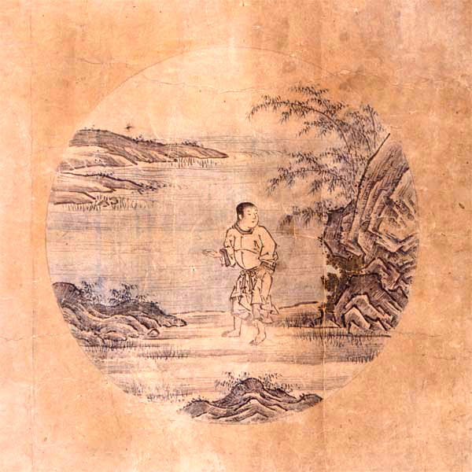
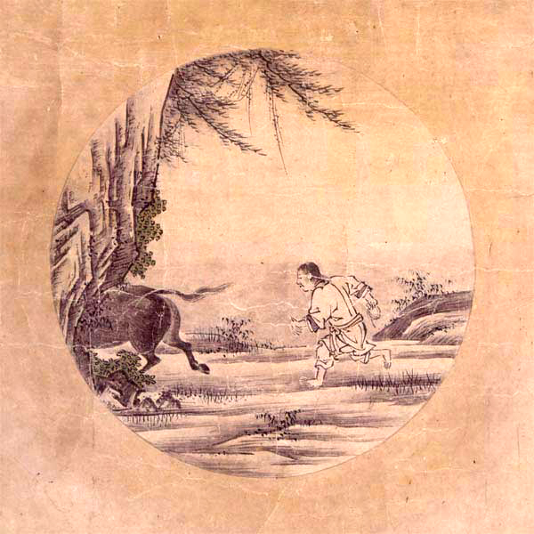
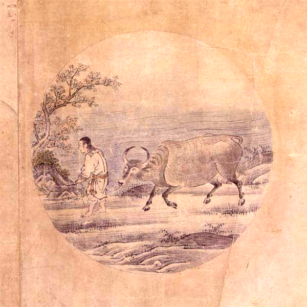
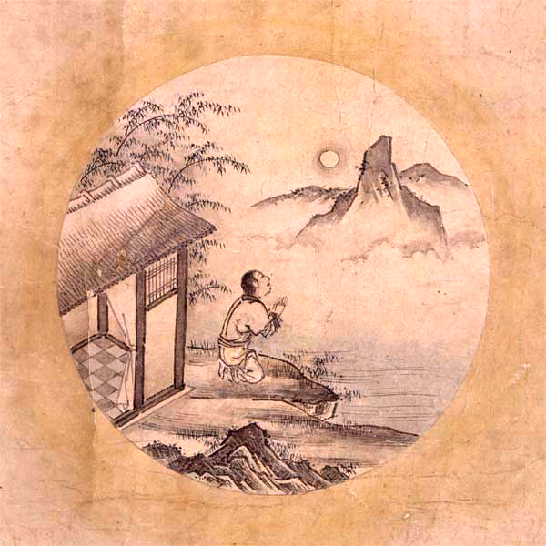
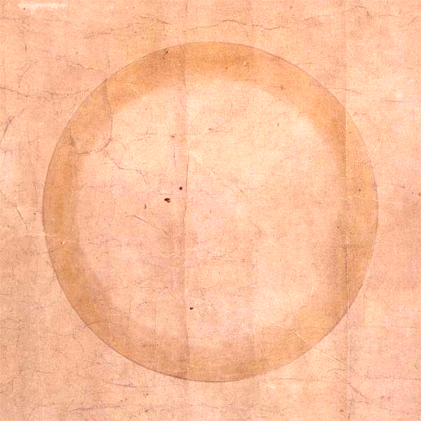

##  日本語が動作認知に与える影響 {#influence-of-japanese-language-on-cognition}

日本語には、モーラ拍リズムという世界的に見るととても珍しいリズム認識を持っています。その日本語を母国語として話す日本人は、言語の発音構造の影響を受けることにより、その行動上起こる認知偏りに大きな特徴が見られます。その認知偏りの特徴とその偏りが起こるメカニズムをひとつの大きな仮説として提唱します。

### 裏拍が先行する感覚と表拍が先行する感覚の違いを「動き」で説明する

#### 1. 身体の動きを使ってリズム感覚を説明する

人が動いている車を避けようとする行動を例に挙げると、**裏拍が先行する感覚（backbeat-leading sense）** と **表拍が先行する感覚（downbeat-leading sense）** の違いを明確に理解できる。ここで、車が左側から現れて右方向へと速く走り抜けていく場面を考える。

#### 2. 衝突する人と衝突しない人の動きの違い

##### 衝突する人（表拍が先行する感覚）の場合：

衝突する傾向のある人は、単純にその時点の車の位置だけを基準に状況を判断する。現在、車が自分の左側にいるのを見て、本能的に右側へ避けようとする。しかし、車はその人が思う以上に速く右側へ移動しているため、その人が右に移動した瞬間にちょうど車の進行経路に入ってしまい、衝突を起こしてしまう。

##### 衝突しない人（裏拍が先行する感覚）の場合：

一方、衝突を避ける人は、現在の車の位置を見るだけでなく、車が次にどこへ動くのかという未来の位置を予測して行動する。最初は直感に反するように見えるかもしれないが、この人は、あえて車が現在いる左側に移動する。なぜなら、この人がその地点に到達する頃には、車はすでに右側へと走り去っているため、左側への移動がむしろ安全になるからだ。このように車の軌道を正確に予測することによって、この人は衝突を回避することができる。

#### 3. 表拍が先行する感覚の特徴

表拍が先行する感覚を持つ人は、**すでに起こったこと（前の拍）に注意を向ける**。彼らは、すでに観察した過去の拍を基準に、そこから一定の時間を測った後で自分の拍を演奏しようとする。そのため、時間感覚としては常に基準となる出来事の「後ろ」に位置している。

しかし現実の音楽演奏では、テンポは自然に揺れ動くものである。過去の拍から正確に一定間隔を測ったとしても、それが次の拍の位置と正確に一致するとは限らない。したがって表拍が先行する感覚の人は、一般的に**一定したテンポを維持することが難しい**。

#### 4. 裏拍が先行する感覚の特徴

裏拍が先行する感覚を持つ人は、過去に起きた出来事を観察し、それを基にして**次に起こること（次の拍）を予測する**。彼らは次の拍の位置を予測して前もって自分の拍を準備し、常に自分の認識する時間軸のなかで基準となる出来事よりも「前」に位置している。

実際の音楽演奏においてテンポが常に揺れ動いていても、裏拍が先行する感覚を持つ人は、予測した拍の位置と実際に起きた拍の位置を絶えず比較することで、自分のタイミングを微調整することができる。このような継続的な予測と調整により、**安定した一定のテンポを維持することが可能となる**。

表拍裏拍は、必ずしも4分音符の1系統しかない訳ではありません。8分音符で見た時にも、奇数拍は表拍で、偶数拍は裏拍です。この様に複数の音価で複数の系統の表拍裏拍が常に同時に存在します。

### ぶつかりそうになる人
終電間際の比較的空いている蒲田駅で連続ワンテンポ遅れ同方向避け野郎と鉢合わせでそうでなくてもイラついている最中、苛立ち爆発。

  * 相手が進む方向を見て相手の背後方向を通過するよう方向調整し、すれちがう際の安全マージンを確保
  * この前挙動(弱起)で相手がどちらに避けるか意思表示が完了
  * 前挙動がないのでこちらが方向転換し相手の前方を横切らないように大幅に進路変更
  * ここで相手は私が回避行動をとっている事を認識
  * ここで遅れて「相手に迷惑かけてはいけない原則」が発動
  * 慌てて回避行動を開始
  * もう既に私が回避行動を取った後
  * 同方向避け発生
  * パニック
  * 私が苛立ってまた進路変更
  * 「相手に迷惑かけてはいけない原則」が発動
  * 慌てて進路変更
  * また同方向避け事案発生
  * 私激怒

そもそも『相手が進む方向を見て相手の背後方向を通過するよう方向調整することですれちがう際の安全マージンを確保』これが無い段階で死亡フラグが確定している。

その後の回避遅れの全ての原因も同一。

<blockquote class="twitter-tweet">
日本人のドラマーは一般的に音が小さい ─── それは和製ジャズマンにとっては良いことと思われているけども、それは断じて間違っている。  外国のドラマーの演奏を聴くとその音の大きさに驚く。本当に目一杯叩いている。だけど他の楽器の音をかき消すこともなく、普通に綺麗に聴こえる。  何故か。
&mdash; 岡敦/Ats🇯🇵 (@ats4u) <a href="https://twitter.com/ats4u/status/1599312979782406144?ref_src=twsrc%5Etfw">December 4, 2022</a></blockquote>

### 日本語が認識にもたらす影響 (The influence of the Japanese language on cognition)

<blockquote class="twitter-tweet">
羽田空港に来た。私は日本人だから、距離も取らず避けもせずまっすぐ突撃してくる日本人をむかつきつつも親切に避けるが、外国だったたら普通にドツカれてホームから突き落とされて普通に死ぬだろう。 日本人の全く周りの動きを見ない歩き方は明らかに異様だ。
&mdash; 岡敦/Ats🇯🇵 (@ats4u) <a href="https://twitter.com/ats4u/status/1893656126081634531?ref_src=twsrc%5Etfw">February 23, 2025</a></blockquote>

|      | 縦乗り                                                               | 横乗り                                                           |
| ---- | -------------------------------------------------------------------- | ---------------------------------------------------------------- |
| 通勤 | 出勤は時間通りだが退勤はルーズ                                       | 出勤はルーズだが退勤は時間通り                                   |
| 舞踊 | パルスが鳴った後に動き始め止まらない。                               | パルスが鳴る前に動き始めパルスで止まる。                         |
| 歩行 | 相手のその瞬間の現在位置に対してのみ反応。                           | 相手の次の瞬間の予想位置に対して反応。                           |
| 音楽 | 最初に表拍を演奏し、裏拍の位置が定まらない。 拍を同時に演奏する。 | 必ず裏拍を先に演奏し、表拍で止まる。 拍を互い違いに演奏する。 |
|      |                                                                      |                                                                  |

<blockquote class="twitter-tweet" data-media-max-width="560">
リボ払いは世界的に一般的なシステムだが日本だけで独特な問題を引き起こしていると言う。これも日本語特有な認知バイアスが影響している可能性が高い。
&mdash; 岡敦/Ats🇯🇵 (@ats4u) <a href="https://twitter.com/ats4u/status/1934837338930336088?ref_src=twsrc%5Etfw">June 17, 2025</a></blockquote> 

## 縦乗りのメカニズム <!-- {#mechanism-behind-tatenori}-->

これまでに御紹介したグルーヴ理論を使うことで、日本人が何故縦乗りになるのか、縦乗りの背後に横たわるそのメカニズムを御説明致します。

## 縦乗りの精神分析 <!-- {#tatenori-and-psychology}-->

縦乗りに関連して起こる精神的な現象について説明します。

### 自分自身の縦乗りに気付かない

歩いても縦乗り、走っても縦乗り、立っても縦乗り、座っても縦乗り、踊っても縦乗り、手を挙げても、頭を挙げても、手を下げても、頭を下げても、怒っても縦乗り、笑っても縦乗り、何をやっても縦乗り  ───日本人の動作には、客観的に見ると即座にそれとわかるはっきりとした特徴があります。

しかし日本人はこの特徴に気付く事が出来ません。何故なら比較対象を持たないからです。

### 縦乗りに気付く難しさ

縦乗りの人同士でコミュニケーションをしていても、その縦乗りという特徴に気付きません。他者が比較対象として機能しないからです。人は横乗りの人と出会って初めて、そこで縦乗りの存在に気付くことが出来ます。

この横乗りの人と出会った時、彼は、単に比較対象を持つことが出来たに過ぎません。ここで必ずしも縦乗りの存在に気付くとは限らないのです。 そこから彼は横乗りという他者とぶつかりあい、そのぶつかりあいのなかで自分の違いに気付き、更にその自分自身の違いとぶつかりあい、そのぶつかりあっているものが相手の存在ではなく、自分自身の中に潜む自分自身の特質だったことに気付いて、敵が自分自身の中にいることを認識し、その敵と真摯に向き合う覚悟が出来なければ、その縦乗りの存在に気付くことができません。

─── これは仏門の修行に相当する非常に高い困難が伴う精神作業です。十年以上に渡って、その哲学的な差異と真摯に向かいあって自己を探求する事は決して容易なことではありません。

ここではこの縦乗りという自分自身の中に潜む敵と向かい合う為の武器として、これまでに御紹介したリズム理論を駆使し、縦乗りが起こるメカニズムについて説明します。

その為にまず禅思想の十牛図を御紹介致します。十牛図は、縦乗りの人が自分自身の縦乗りに気付くまでの道程と多くの類似点があります。十牛図の意味を知ることは、縦乗りと向き合う為の大切な武器のひとつです。

## 十牛図

十牛図とは、禅思想で使われる悟りに到るまでの道程を見える化した１０の図のことを指します。  十牛図には数多くの版が存在することが知られており、最も広く知られている版は、宋代の郭安の十牛図と普明禅師の十牛図だと考えられています。

牛飼図は通常、詩と絵からなり、詩自体に短い序文が付いていることもあります。宋代以降、このような作品は数多く作られ、その中でも特に注目すべき3作が「清居」「郭安」「子徳」です。清居の作品は5図、郭安の作品は10図、子徳の作品は6図で、これらの作品の中で**郭安**の作品が最も完備していると考えられています。

<table class="ten-bulls-table"><tbody>
<tr>
<td></td>
<td></td>
<td></td>
<td></td>
<td></td>
</tr>
<tr>
<td></td>
<td></td>
<td></td>
<td></td>
<td></td>
</tr>
</tbody></table>

### 十牛図の意味

これは中国の仏教の学校 [学山禅院](http://www.xueshanchanyuan.com/index/article/detail/id/1570.html) の十牛図解説の抄訳です。

『十牛図』は、宋代の禅僧・廓庵禅師によってまとめられた修行の十段階を象徴的に描いた図と詩文です。牛は「本心（仏性）」を象徴しており、牛を探す旅を通して、人間が本来持っている仏性を自覚し、悟りに至るまでの道のりを表現しています。

この十段階は、単なる順番的な修行ではなく、**あらゆる瞬間に悟りのチャンスがある**ことを示しています。文字や形式にとらわれず、心の本質に立ち返ることが重要であると説いています。

#### 1. **尋牛（じんぎゅう）**

- 仏性を象徴する「牛」を探し求めて修行を始めたが、まだその牛を見つけることができない状態です。人間は本来仏性を備えているものの、それを忘れてしまい、煩悩や分別の世界に陥って真実の自己から遠ざかっています。

迷いの中で、自分の本心を探し求めている段階です。牛（＝本心）は実は常にそこにあるのですが、私たちはそれに気づかず、外に求め続けます。仏法に出会い、ようやく「本心を探す」必要性に目覚めます。

####  2. **見跡（けんせき）**

- 経典や師の教えを手がかりとして仏性を探そうとしても、依然として煩悩や分別の世界から抜け出すことができず、牛そのものではなく牛の足跡しか見えていない状態です。

ようやく牛の足跡（＝本心の痕跡）を見つけます。日常生活の中の見聞触覚や感情のすべてに、本心の働きが現れていることに気づき始めます。ですが、多くの人はまだ文字や形式に執着し、真実の自心を見失っています。

####  3. **見牛（けんぎゅう）**

- 修行を積み重ねていくうちに、ついに牛の姿を実際に目の当たりにする段階です。真実の自己、仏性を実感し始める境地です。

牛の姿がはっきりと見えてきます。つまり、仏性や本心を直接感じ始める段階です。六根（目・耳・鼻・舌・身・意）を通じて、あらゆる現象の中に仏性の働きを見出します。

####  4. **得牛（とくぎゅう）**

- 牛（仏性）を一度捉えたとしても、それを完全にコントロールするのは容易ではなく、時には逃げ出してしまうこともあるでしょう。修行の難しさと忍耐の必要性を象徴しています。

ようやく牛を捕まえることができました。悟りの感覚が明確になりますが、まだ心は安定しておらず、妄想や習気（くせ）が強く、修行の努力が必要です。

#### 5. **牧牛（ぼくぎゅう）**

- 牛をしっかりと飼いならす段階を表します。自分の本性（仏性）を確かに手に入れたら、それを失わないよう注意深く見守り制御する必要があります。修行が深まるにつれ牛は徐々に従順になります。

牛をしっかりと調教していく段階です。日常生活の中で心を見守り、妄想が起きたらすぐに気づくようにします。この「牧牛」の修行が、実際の修行の核心です。

#### 6. **騎牛帰家（きぎゅうきか）**

- 牛と牧童（修行者）が完全に一体化し、心の平安が得られた状態を表します。もはや牛を制御する必要はなくなり本来あるべき場所へと穏やかに帰ってきたことを表します。

牛に乗って、ゆったりと家に帰る段階です。心の安定と解放感があり、無理せずとも心が本質と調和しています。悟りの余韻の中で、自然体で生きることができるようになります。

#### 7. **忘牛存人（ぼうぎゅうそんじん）**

- 心の本来の場所に戻った修行者は、牛を捉えたことすら忘れてしまう状態を表しています。この段階では、牛（仏性）は自然なものとなり、特別な意識の対象ではなくなります。

牛（仏性）を忘れて、人（主体）だけが残ります。すでに牛は完全に調伏され、意識せずとも心は乱れず、平常心で生活できるようになります。悟りへの執着も消え、「無為自然」の境地に至ります。

#### 8. **人牛倶忘（にんぎゅうぐぼう）**

- 牛を捉えようとした理由も、牛を捉えたことも、そしてその行為そのものも忘れ去られた状態を表します。主体と対象の区別が消え、忘れること自体もない完全な無我・無心の境地を表します。

人も牛も共に忘れ去られる段階です。修行の対象や主体すら意識から消え、「無心」「無我」の状態となります。知や言葉の働きも超えており、言葉では言い表せない悟りの深みに達します。

#### 9. **返本還源（へんぽんかんげん）**

- あらゆる執着や分別が消え去った清浄無垢な境地に戻った状態を表します。ありのままの世界をあるがままに受け入れ、真実の自己と世界の根源的な姿を認識する状態になったことを示しています。

悟りを得た後、さらに「本来のあり方」へと帰っていきます。悟った人は、世俗にとらわれず、また悟りにもとらわれません。ただ静かに、自然のままに生きる姿が描かれます。

#### 10. **入鄽垂手（にってんすいしゅ）**

- 悟りを得たとしても、その境地に留まっているだけでは無意味ということを表しています。再び俗世の中に入り、人々と共に生き、人々に安らぎを与え、慈悲と智慧をもって導くことこそが究極の目的だということを表しています。

最後の段階では、修行を完成させた人がふたたび世俗の中に戻り、見かけは普通の人として生きます。修行や悟りの姿を見せびらかすことなく、人々と自然に関わりながら、仏法を伝えていきます。

## 縦乗りに気付くまでの道程

モーラ拍言語(日本語)を母国語とする人が自身の縦乗りに気付く過程は、十牛図ととても良く似ています。

- 縦乗りの存在自体に全く気付いていない。
- 縦乗りの存在には気付いたが違いがあるかまではつかみきれない。
- 縦乗りに違いがあることには気付いたが、何が違うかまではつかみきれない。
- 縦乗りとそうでないものの違いを指摘出来る、どこが違うかまではわからない。
   縦乗りとそうでないもののどこが違うかはわかったが、何故違うかまではわからない。
-  縦乗りとそうでないものを比べて何故違うかわかったが、全体像はつかみきれていない。
-  自分が全ての違いを把握していないということ自体に気付いていない。
-  単独で横乗りで演奏できるようになったが、縦乗り音が聴こえるとつられて縦乗りに戻ってしまう。
-  縦乗りに戻ってしまったことに気付いていない。
-  違いは聞き取れていても、自分自身の身体を動かして非縦乗りの動作を実演出来ない。
-  自分の動作が縦乗りになっていることに気付いていない。
-  自分の動作が縦乗りになっていることに気付いていても縦乗りを直せない。
-  自分の動作が縦乗りになっていることに気付いていても縦乗りを直せるが全ては直せない。
-  意識しないと縦乗り動作を抑制出来ない。
-  意識しないと縦乗りに戻ってしまう。
-  意識しなくても縦乗りに戻らないで横乗りを維持できる。
-  何も意識せずに横乗りを維持できる。
-  どんなときでも即座に縦乗りと横乗りを自由自在に切り替えることが出来る。

### 縦乗りに気付く必要性に気付く

しばしば縦乗りを見た人は自問します ─── そもそも何故縦乗りに気付かなければならないのでしょうか。

  - 何故、縦乗りではいけないのか
  - 何故、縦乗りに気付く必要があるのか
  - 何故、縦乗りを向き合わなければいけないのか
  - 何故、縦乗りを知る必要があるのか
  - 何故、縦乗りを直さなければいけないのか
  - 何故、縦乗りと向き合わなければいけないのか
  - 何故、横乗りを知る必要があるのか
  - 何故、横乗りと仲良くする必要があるのか

ここで最も大切なことは、「彼は縦乗りの存在に気付いていない訳では無い」ということです。それどころか既に縦乗りに気付いて何度も縦乗りと格闘しその克服の難しさに打ちひしがれて苦しんでいる状態と言えます。

縦乗りに気付けば気付くほど、その解決の難しさと直面し、絶望する。絶望する恐怖からその困難の直視を避けて、責任転嫁しようとする。合理化しようとする。

### 縦乗りの一方構成

縦乗りには **一方向性** があります。縦乗りと横乗りには互換性がない ─── よってどちらかがどちらかに合わせる必要があります。ところが、横乗りの人は縦乗りに簡単に合わせることができるのに、縦乗りの人は横乗りの人に合わせること容易ではない。これが **縦乗りの一方構成** です。

─── その本質は、既にあるもの頭子音最大化原則（MOP)を抑制すれば頭子音最小化原則（MiOP)に対応できる横乗り＝ストレス拍リズム・シラブル拍リズムに対して、モーラ拍リズムの人はまだないものを全て新規に獲得する必要があるという理不尽ともいえる発音構造上の不平等関係がそこにあるからです。 縦乗り横乗りには、そんな優勢・劣勢の関係がそこに存在します。

日本外の世界の大半の言語は横乗り（シラブル拍・ストレス拍）が基盤になったコミュニケーション方法が根底に一貫しています。 そこで「縦乗り(モーラ拍)でも良いではないか」と主張してしまうと、その場にいる人全員 ─── その場にいる人が二人であれば２人とも ─── その場にいる人が1000人いれば1000人全員に、縦乗りに合わせてもらうことを強制する必要があるからです。

日本以外の世界に出ていくなら、ストレス拍・シラブル拍の認識に歩み寄る必要があるといえます。しかし日本内の世界に留まるなら、ストレス拍・シラブル拍に歩み寄らなくてよいのでしょうか。

実は日本語の方言は、東に行くほどストレス拍リズムが強くなるという説があります。発音の省略が多く早口な江戸弁をはじめ、東北弁の多くは、標準的な日本語とことなり、発音の短縮が多く見られます。また関東・東北の多くの民謡は、完全な縦乗りではなく、しばしば長い弱起が見られます。 ─── つまり横乗りの人は日本国内にこそいます。いかに日本国内であっても広い社会で生活するなかでは横乗りと協調すべき状況は決して少なくありません。多様性への対応力は、豊かさの大切な基盤でもあります。

広い世界に出ていけば出ていくほど、異質な人々と激しくぶつかりあい、縦乗りというイデオロギーを否定されてしまうという現象があります。

その厳しい現実と向き合う人が取るリアクションは、人によって様々です。

勿論ここで「それでも縦乗りでよいではないか」という答えを出すことも可能です ─── <ruby>律動<rt>リズム</rt>図鑑<rt>ペディア</rt></ruby>は飽くまでも「敢えて横乗りに打って出るにはどうすればよいのか」という決意をした人への解答を提供することが趣旨のサイトです。ここで前に進むか留まるかを決めるのは、このサイトを読む皆様自分自身でしかありません。

## 縦乗りと防衛機制

### 縦乗りとは何か

### 縦乗りとは
縦乗りとは日本人独特なシンコペーションがないリズムです。

### 縦乗りの問題
縦乗りの問題は大きく分けて２つあります。
* まず日本語を母国語とする人はシンコペーションを認識すること自体に大きな困難があること。
* 日本社会でシンコペーションを習得しようとすると、リズムを習得する困難さと向き合う以上に、大きな社会的圧力と向き合う必要があること。

### 縦乗りの技術的問題
縦乗りと横乗りは同時に演奏できない。

### 横乗り大音量錯覚について
* 縦乗りの人々にとって横乗りは大音量に聴こえる。
    * → 音ずれが音の分離をはっきりさせる。
    * → 未体験の音の際立ちに衝撃を受ける縦乗りの人々
    * → 「音が大きすぎる！！！！」というリアクション
* 縦乗りセッション社会で、横乗りが排除される構造を生み出す。

### 縦乗り防衛機制について
* 誰もがグルーヴしたいと思っています！
    * →しかし日本語の持つ制約から日本語を母国語とする人は外国のグルーヴを演奏することに大きな障害を伴います。
    * → 誰もが海外の音楽に強い憧れを持ち、音楽を志します。そして誰もが音楽に対して人生を賭して莫大な犠牲を払っています。しかし長年の苦労ののちに、実は真の音楽が全く手に入らないものだと気付いた時、人々は精神崩壊の危機にさらされます。
    * → そこで日本人独特なリアクションが生まれます。
    * → これが縦乗りゴーマニズムです。

### 縦乗りゴーマニズムとは
* 縦乗りというリズム自体は問題ではない点に注意。
* 横乗りというリズムが手に入らないと気付いたときに、妬み嫉みというネガティブな感情が生まれる。
* 絶望を直視する事を回避する為にあらゆる心理的防衛機制が働きます。
* それがしばしば、グルーヴを志す人への攻撃となって表出します。

### 縦乗り防衛機制の例

<!--
| 種類     | 内容                                                                                                                                | 例                                                                                                                                                                                                                                                                                           |
| -------- | ----------------------------------------------------------------------------------------------------------------------------------- | -------------------------------------------------------------------------------------------------------------------------------------------------------------------------------------------------------------------------------------------------------------------------------------------- |
| 抑圧     | 不快・苦痛の感情を意識に受け入れがたく、無意識のうちに忘れる・気づかないようにする。これが意図的・意識的である場合は、抑制という。  | 「えっ？縦乗りなんか気にしてるの、岡だけじゃない？」                                                                                                                                                                                                                                         |
| 否認     | 現実を自分が知覚していながら、意識から排除して認めないこと苦痛に対して「大したことはない」と思う。                                  | 「縦乗りなんて、別に大した問題じゃないですよね？」                                                                                                                                                                                                                                           |
| 退行     | 早期の発達段階へ戻ること。子ども返り。                                                                                              | 「ふざけんなよ！このやろう！（演奏中いきなり怒鳴る）」                                                                                                                                                                                                                                       |
| 転移     | 特定の人に向けていた感情を、よく似た人（精神分析の治療者)に置き換える。陽性転移は、好意・依存、陰性転移は、敵意や嫌悪の感情を持つ。 | 「いやー岡さんの演奏、ウェスモンゴメリみたいですね！」   「いやー岡さんの言ってること、ジョージ大塚と同じですよね。」                                                                                                                                                                     |
| 投影     | 相手に向けての感情を自分のものとして受け止めがたいため、相手が自分に向けていると思う。                                              | 「なんでそうやって縦乗りを否定するんですか！？」                                                                                                                                                                                                                                             |
| 反動形成 | 本心とは逆の言動をする。弱者のつっぱり。                                                                                            | 「いや俺、別に横乗りになりたいと思ってないし。」                                                                                                                                                                                                                                             |
| 昇華     | 反社会的な欲求を、社会的に適応の高いものに置き換える。                                                                              | 「横乗りをマスターしたくて今でも毎日メトロノーム練習続けています。」                                                                                                                                                                                                                         |
| 補償     | 劣等感を他の方向で補う。「勉強で負けたら、運動で勝て」                                                                              | 「私この間、ギブソンのビンテージ買ったんですよ！◯◯万円もしたんです！」                                                                                                                                                                                                                       |
| 合理化   | 一見理論的であるかのように装うが、実は不都合な現実を歪めたり、都合のよい現実を取り上げて、自分の欲求や感情を正当化する(責任転嫁）   | 「岡さんは、そうやって縦乗りを理論的に説明しているようでいて、結局自分自身の劣等感を補償しているだけですよ。その証拠に誰も岡さんに同意している人がいないじゃないですか。現実を直視出来ていないのはどっちなんですか？」  「またリズム警察ですかｗｗｗ」  「リズムおじさんｗｗｗ」 |
-->

#### 抑圧
不快・苦痛の感情を意識に受け入れがたく、無意識のうちに忘れる・気づかないようにする。これが意図的・意識的である場合は、抑制という。

> 「えっ？縦乗りなんか気にしてるの、岡だけじゃない？」

#### 否認
現実を自分が知覚していながら、意識から排除して認めないこと苦痛に対して「大したことはない」と思う。

> 「縦乗りなんて、別に大した問題じゃないですよね？」

#### 退行
早期の発達段階へ戻ること。子ども返り。

> 「ふざけんなよ！このやろう！（演奏中いきなり怒鳴る）」

#### 転移
特定の人に向けていた感情を、よく似た人（精神分析の治療者)に置き換える。陽性転移は、好意・依存、陰性転移は、敵意や嫌悪の感情を持つ。

> 「いやー岡さんの演奏、ウェスモンゴメリみたいですね！」
> 「いやー岡さんの言ってること、ジョージ大塚と同じですよね。」

#### 投影
相手に向けての感情を自分のものとして受け止めがたいため、相手が自分に向けていると思う。

> 「なんでそうやって縦乗りを否定するんですか！？」

#### 反動形成
本心とは逆の言動をする。弱者のつっぱり。

> 「いや俺、別に横乗りになりたいと思ってないし。」

#### 昇華
反社会的な欲求を、社会的に適応の高いものに置き換える。

> 「横乗りをマスターしたくて今でも毎日メトロノーム練習続けています。」

#### 補償
劣等感を他の方向で補う。「勉強で負けたら、運動で勝て」

> 「私この間、ギブソンのビンテージ買ったんですよ！◯◯万円もしたんです！」

#### 合理化
一見理論的であるかのように装うが、実は不都合な現実を歪めたり、都合のよい現実を取り上げて、自分の欲求や感情を正当化する(責任転嫁）。

> 「岡さんは、そうやって縦乗りを理論的に説明しているようでいて、結局自分自身の劣等感を補償しているだけですよ。その証拠に誰も岡さんに同意している人がいないじゃないですか。現実を直視出来ていないのはどっちなんですか？」
>
> 「またリズム警察ですかｗｗｗ」
>
> 「リズムおじさんｗｗｗ」

### 縦乗りゴーマニズムへの対応の難しさ
* 縦乗りゴーマニズムはしばしば、集団ヒステリ的な様相を帯びて、対個人への集団攻撃という現象につながりやすい。
    * → 日本社会が持ついじめの構造を持ち始める。
    * → 結果的に、セッション社会でグルーヴを志すどころか、リズムについての話題を出すだけで、過敏な反応を受けやすい。

### 縦乗りゴーマニズムの問題点
* 縦乗りゴーマニズムと遭遇することを恐れる。
    * → リズムの話題に触れることが難しい。
    * → 横乗りグルーヴを目指している人同士が知り合う機会がない。

### 縦乗りに対するあるべき対応
* 縦乗りと横乗りのバランスを取る

### 縦乗りと横乗りのバランスを考える
* バイクを作る
    * 確実さと安定を重んずる
        * → 縦乗り
* バイクに乗る
    * 不安定さがもたらす自由を楽しむ
        * →横乗り
### 現代日本人として完全な横乗りは破滅を意味する
* 実は、縦乗りを捨てれば横乗りになるのは容易い。
* むしろ、いつでも好きなときに横乗りに切り替えることの出来る能力を獲得する。
* そのために、横乗りを縦乗りで再解釈し、切り替える為のトリガとする。

### 縦乗りの良さを横乗りで伝える
* 演歌・アニソン・ゲーム音楽等々…世界は日本を求めている。
* → しかし縦乗りは横乗りの人々にとって理解不能。
* → 横乗りを習得し、縦乗りを横乗りに翻訳する。

### 縦乗りの良さを横乗りで伝える
* オフビートメトロノーム練習
* オフビートカウント練習

<!--
## 縦乗りの存在に気付く

そもそも縦乗りと横乗りの違いの区別がつかないという状況はとても一般的です。そもそも横乗りと出会っても、そこに縦乗りとの違いが存在することに気付かなければ、縦乗りの存在にも気付かないのは自明です。

## 自分自身に潜む縦乗りに気付く

縦乗りの存在に気付き、

## 🧠 縦乗りの心理構造とリズム類型論からの総合的分析

（縦乗り防衛機制 ＋ リズムの優性／劣性構造を含む）
---

### 1. 🧩 中核理論：リズムにおける「優性／劣性」の概念

本理論では、リズムの種類には**言語に基づく“優性”と“劣性”の関係**が存在すると考えます。

| リズムの種類         | 認知的な構造             | 優性／劣性                 |
| -------------------- | ------------------------ | -------------------------- |
| **ストレス拍リズム** | 階層的な強拍／弱拍の構造 | **優性**（輸出可能）       |
| **シラブル拍リズム** | 単調な等長リズム         | 中立〜中間的               |
| **モーラ拍リズム**   | 均等単位で非階層的       | **劣性**（非互換・非再現） |

#### 🔁 一方向的な互換性（Rhythmic One-Way Compatibility）

* ストレス拍リズム話者は、モーラ拍リズムやシラブル拍リズムをある程度**模倣可能**です。
* しかしモーラ拍話者（特に日本語母語話者）は、**ストレス拍の階層的リズム構造を知覚するのが困難**です。
* これはリズム感における**非対称な認知構造**を生み出します。

---

### 2. 💥 縦乗りの心理的反応と防衛機制

#### （1）拒絶のスパイラル

グルーヴや横乗りの音楽に直面したとき、日本語話者に起こる心的プロセス：

1. **知覚のズレ**：「うるさい」「合っていない」などの違和感
2. **認知的負荷**：「なぜリズムが取れないのかわからない」
3. **感情の葛藤**：「長年練習したのに、なぜスウィングできないのか？」
4. **アイデンティティの危機**：「自分のリズム観は否定されるのか？」
5. **心理的防衛**：「グルーヴは不要」「日本らしくない」と正当化
6. **外部攻撃**：「グルーヴを語る人」を攻撃対象にする

---

### 3. 🧠 縦乗りコンプレックスの心理層構造

| 層             | 内容                                                               |
| -------------- | ------------------------------------------------------------------ |
| 表面の行動     | 「音が大きい」「リズムがずれてる」といった拒絶的反応               |
| 社会的パターン | グルーヴ実践者への嘲笑、排除、同調圧力による“空気読み”             |
| 感情的反応     | 羨望、怒り、孤独感、裏切られた感覚                                 |
| 認知的ブロック | 弱強の階層リズムを把握できない（言語習慣に起因）                   |
| 文化的背景     | モーラ拍言語の頭揃えリズムにより、グルーヴの発生条件が欠如している |

---

### 4. 🧬 リズムの遺伝的メタファー

この理論では、**音楽リズムの優性・劣性構造**を**遺伝のメタファー**で説明しています。

* 優性リズム（ストレス拍）は、混合環境において他を上書きしやすい性質を持ちます。
* 一方、劣性リズム（モーラ拍）は、他のリズム構造を**吸収・再現できません**。
* このため、グローバル音楽市場では：

  * ジャズ／ファンク／ヒップホップ ⇒ **世界に広がる**
  * 演歌／J-POP／アニメソング ⇒ **国内向けに閉じる**

---

### 5. 🎭 日本社会における縦乗り現象の社会的帰結

| 項目                 | 内容                                               |
| -------------------- | -------------------------------------------------- |
| 音楽的アウトプット   | ピッチ重視、縦揃え、グルーヴ欠如                   |
| ジャズ文化           | 技術偏重、スウィング軽視、精神性の喪失             |
| グルーヴ実践者の扱い | 誤解、排除、孤立化                                 |
| セッション文化       | リズムの話題がタブー化、協働的進化が困難           |
| 英語教育             | リズムが無視され、英語が日本語リズムに“中和”される |

---

### 6. 🔧 解決策：リズム的バイリンガリズムの提案

* 🎯 **縦乗りも横乗りも自在に切り替えられる能力**を養うことが重要です。
* 🔁 縦乗りリズムを**横乗り的に再解釈**することでトリガーとして利用します。
* 🗣 日本のリズム文化（演歌・アニメ・ゲーム音楽など）を、**横乗り話者にも伝わる形で翻訳**します。
* 🧠 そのために、**Offbeat Count（オフビートカウント）やMeta-Division Counting（メタディヴィジョン）**といった**リズム知覚訓練**が有効です。

---

## 📌 最終まとめ：縦乗りは認知・心理・文化の三重問題

| 分類         | 内容                                                                       |
| ------------ | -------------------------------------------------------------------------- |
| 言語的背景   | モーラ拍＝等間隔の拍、強弱の階層性がない                                   |
| 認知的症状   | 弱拍・裏拍を感知できない、遅れて反応する                                   |
| 感情的結果   | フラストレーション、劣等感、否認、防衛反応                                 |
| 社会的構造   | 集団圧力、リズム話題のタブー化、孤立化                                     |
| 音楽的結果   | 精度は高いが魂がない、タイミングの融通が効かない                           |
| 解決の方向性 | 内部的再訓練と外部的翻訳、縦乗りから横乗りへスムーズに移行できる能力の育成 |

---

ご希望があれば、上記内容を **スライド形式**、**論文形式**、あるいは **Rhythmpediaのセクション草稿**に整形できます。どの形式でまとめましょうか？

## 縦乗りの心理分析とリズム類型論にもとづく続発的考察

### １. 縦乗りの定義と基礎問題

縦乗りは、日本語言語貞者に見られる独特なリズム観であり、シンコペーションの無い、抑制されたビート配置が特徴とされる。本論文では、この縦乗りが協和的な社会構造とどのように連動しているかを心理学的な観点から解析する。

---

### ２. リズム類型に見られる優性/劣性と一方通行性

言語によるリズム構造は三種に大別分類される：

| リズム類型       | リズム構造            | 優劣性        |
| ---------------- | --------------------- | ------------- |
| ストレス拍リズム | 階層的な強拍/弱拍構造 | 優勝 (輸出可) |
| シラブル拍リズム | 積分的／一論の拍の列  | 中立          |
| モーラ拍リズム   | 積分と平均性に基づく  | 劣勝 (非返復) |

優劣性は、日常言語でも触覚されないが、リズム的な交渉の中で強く現れる。ストレス拍リズムを持つ言語貞者は、その構造の複雑性により、他のリズムをも印象として解釈できる。しかし、モーラ拍のみを基礎とする言語は、階層構造を知覚的に構成することが困難であり、ここに一方通行性が生まれる。

---

### ３. 縦乗りの心理的忍耐和防衛機制

縦乗りの人々は、外国のグルーヴある音楽を直接体弾にするとき，以下のような心理プロセスを通過する：

1. 音響触覚の異常
2. 自分の未熟さに対する不安
3. 精神的突破の機器
4. 自身のリズム感覚の否定
5. 情勢を押さえるための理論化
6. グルーヴ実践者への攻撃

これは、言い換えれば「縦乗り防衛機制」と呼ばれる。

---

### ４. 縦乗りゴーマニズム

リズム自体は問題でない。問題となるのは、正式なグルーヴが体弾できないことに気づいたときの、悪意を持たない自衛的イデオロギーである。

この童話的自衛は、しばしば社会的な同調圧力や同調装置を代理して現れ、「リズムの話題自体がタブー化される」という現象を与える。

---

### ５. 社会的構造としての縦乗り

| 項目             | 結果                             |
| ---------------- | -------------------------------- |
| 音楽アウトプット | ピッチ重視、縦揃え、グルーヴ無視 |
| ジャズ文化       | 技術偏重、霊魂性の失われ         |
| グルーヴ実践者   | 誤解される、社会的に隔離         |
| セッション文化   | 同調圧力、リズム話題の困難化     |
| 英語教育         | リズムが削られ、モーラ拍化       |

---

### ６. 解決方向：リズム的バイリンガル化

* 縦乗りも正式に保ちながら、「自由に切り替えられる能力」を積極的に養う。
* オフビートカウントなどの訓練を通じて、言語を超えた音楽的知覚を構築する。
* 日本特有のリズム文化を、グローバルインフォームに翻訳して伝える。

-->

<!-- VER 2 あとで比較する。-->
<!-- ## 縦乗りのメカニズム {#mechanism-of-tatenori}-->
<!--
### モーラ拍ネイティブが陥りがちなリズム習癖

<blockquote class="twitter-tweet" data-media-max-width="560">
縦乗りと横乗りの違いを完全に把握した。縦乗り解釈する時に音符の位置がずれる。これがいわゆる『日本人の頭重心リズム』のメカニズムだ。  縦乗り（モーラ拍リズム） 横乗り（ストレス拍リズム）<a href="https://twitter.com/hashtag/%E3%82%AA%E3%83%95%E3%83%93%E3%83%BC%E3%83%88%E3%81%A7%E6%80%9D%E8%80%83%E3%81%99%E3%82%8B%E8%AA%9E%E5%AD%A6?src=hash&amp;ref_src=twsrc%5Etfw">#オフビートで思考する語学</a> <a href="https://t.co/o3RILE8EMy">pic.twitter.com/o3RILE8EMy</a>
&mdash; 岡敦/Ats🇯🇵 (@ats4u) <a href="https://twitter.com/ats4u/status/1930932283294544307?ref_src=twsrc%5Etfw">June 6, 2025</a></blockquote>

### 縦乗りに気付く

貴方は、誰かとペアになってその人と交互に手を叩くことは出来ますでしょうか。「何をそんな簡単なことを」とおっしゃるかも知れません。しかしこれは実際にやってみると非常に難しいことだとお気付きになることと思います。

もしかするとメトロノームに合わせて交互に手を叩くことは出来るかも知れません。しかし人間が相手の場合、その手拍子の感覚は揺れ動きます。この様な揺れ動くリズムを相手にして交互に手を叩くことは、とても難しいこととお気付きになるかも知れません。

次にメトロノームを**弱拍**に合わせて即興演奏や特定の楽曲を演奏することは出来ますでしょうか。ここでいう弱拍とは、4分音符でしたら2拍目／4拍目のことです。或いは8分音符でしたら2拍4拍6拍8拍のことです。この弱拍にメトロノームを合わせて演奏することは出来ますでしょうか ─── これは更に難しいことだとお気付きになると思います。

もしかしたら「そんな難しいことは出来ないのが当然だ！」と仰るかも知れません ─── しかしここに、日本語を母国語とする人だけが持っている特殊な時間認識の偏りを観察出来るのです。

弱拍にメトロノームを鳴らすことは決して簡単なことではありませんが、日本語以外の言語を母国語とする人…特に英語を母国語とする人は、これを多少練習すれば習得することが出来るのです。しかし日本語を母国語とする人は長い年月 ─── 場合によっては20年近い年月を要することも稀ではありません。

これにははっきりした理由があります ─── その違いは言語によるリズム認識の違いにあります。

### 交互手叩き不可能性

縦乗りの人は、時間の認識の原理上「2人で交互に手を叩くことが出来ない」という特徴があります。 もしかするとメトロノームに合わせて交互に手を叩くことは出来るかも知れません。しかし不正確な人間を相手に交互に手を叩くことが出来ません。

しかし、相手が人間の場合、人間のリズムには微妙な揺らぎがあることから、その揺らぎに対して柔軟に対応する必要が発生します。つまり交互にリズムを合わせ続けるには「相手のゆらぎを感じ取りながら、自分のタイミングを調整する」という、より複雑な時間感覚が求められます。 ─── この人間同士で交互手叩きを行う場面で、時間認識の違いをはっきりと観察できる現象が観察出来るのです。

縦乗りの人は、時間認識の原理上、一定の間隔で鳴っているパルスと距離を取って同時ではない状態を維持することがとても難しく、結果として、人間同士での即時的なリズムのやりとり──すなわち交互に手を叩くような行為──が出来ないという現象となって観察されます。

一方縦乗りの人は、交互に手を叩くことは出来ませんが、不規則になっている手拍子に合わせて同時に叩くことなら即座に行う事ができます。これはむしろ、縦乗りの人に特徴的な能力で縦乗りの人以外には出来ない行為です。

これは些細なこと…と思われるかも知れません。しかし、ロック・ジャズ・クラシック・ファンク問わず、2人の奏者が交互に音を出すリズムが繰り返し現れることには注意が必要です。西洋音楽の最も基礎にバスドラムとスネアドラムを交互に演奏するリズムが現れます。特に現代あるアメリカ起源のポピュラー音楽は必ずこのリズムが登場します。

### 強拍先行は存在しない

『強弱』の様に聴こえるリズムでも、そこに隠れた暗黙の弱拍を演奏してから強拍を演奏します。海外の音楽には強拍先行は存在しません。一瞥すると強拍が先行する様に見えるリズムでも、実はその前に休符として先に弱拍を演奏する習慣があります。

### リズム解釈の違い
この言語自体が持っているリズム認識の違いは、同じ単語の発音の解釈の違いとして現れます。

| 拍リズム     | バナナ                  | コンピューター    | チョコレート   | カメラ     |
| :----------- | :---------------------- | ----------------- | -------------- | ---------- |
| モーラ拍 🇯🇵   | /**ba**-**na**-**na** / | /ko-m-pyu-u-ta-a/ | /cho-ko-re-to/ | /ka-me-ra/ |
| シラブル拍🇪🇸🇫🇷 | /**ba**-**na**-**na** / | /com-pyu-ter/     | /cho-co-late/  | /ca-me-ra/ |
| ストレス拍🇺🇸🇬🇧 | /ba-**NA**-**na** /     | /kəm-ˈPYU-ter/    | /ˈCHOK-lət/    | /KAM-ruh/  |

このリズム解釈の違いは、言語だけでなく、音楽での強拍と弱拍の前後関係の違いとして現れます。この認識の違いは、即興演奏時や作曲時の無意識の音符の配置の仕方にはっきりとした偏りを生み出します。そしてこの認識の違いは、音楽だけにとどまらず日常的に行う動作と動きの認識、行動全体に対して大きな影響を与えています。

 特にこのリズム認識の違いは、無意識の内に音楽を演奏する時の強拍弱拍の順序の違いとして現れます。

### 強拍弱拍は単独では存在しない
前述の通り強拍と弱拍が存在するためには、当たり前なことですが、最低でも２つ以上の音符が必要です。この事は特筆に値します。海外の音楽には必ず強拍弱拍があります。これは裏を返すと、単独の拍を単独で演奏することがほとんどないということを隠喩しています。 単独の拍を単独で演奏している様に見えても、演奏者及び聴者は、そこに暗黙の弱拍があることを聴き取っています。

しかし日本語のようなモーラ拍リズムの言語を母国語とする人は、しばしば音楽を演奏する時に音符を単独で演奏する習慣を持っています。ここから日本語話者は音符を聞いた時、そこに暗黙の弱拍があることは愚か、そこに強弱の区別がある事にすら気付かないという、日本語話者に独特な盲点が生まれます。

**強拍弱拍は単独では存在できなません。** そして海外の音楽では**単独の音符は存在しません。** このことをここで指摘すると共に今後常にこのことを喚起していく必要があるでしょう。

強拍でも弱拍でもない単独の音符が現れてしまう ─── これがモーラ拍リズム（日本語）話者が持っている１つ目の盲点です。

### 拍リズムによって頭合わせ尻合わせの違いが生まれるメカニズム
#### モーラ拍リズムのリボ払い
#### シラブル拍リズムの月末締め一括払い

### 桃太郎さん現象について
### 最初に聴こえた拍が１拍目強拍に聞こえる症候群について

-->
<!--
盆踊り・マクドナルド

<iframe style="width:100%;height:360px;" src="https://www.youtube.com/embed/zhGnuWwpNxI?si=rmaaGup-ewVlmkTv" title="YouTube video player" frameborder="0" allow="accelerometer; autoplay; clipboard-write; encrypted-media; gyroscope; picture-in-picture; web-share" referrerpolicy="strict-origin-when-cross-origin" allowfullscreen></iframe>

<blockquote class="twitter-tweet" data-media-max-width="560">
【外人が演奏する縦乗り】この方は日本語のリズムと英語のリズムの違いに気付いている ── が見事なまでに縦乗りに失敗している。これは彼が日本語話者でないことを表している。リエゾンによって倒置するオフビートがあり、オンビートは全てレイドバックして遅れている。   <a href="https://t.co/5MrK0hKUHo">https://t.co/5MrK0hKUHo</a> <a href="https://t.co/oJnPHqAaza">pic.twitter.com/oJnPHqAaza</a>
&mdash; 岡敦/Ats🇯🇵 (@ats4u) <a href="https://twitter.com/ats4u/status/1573036257588178944?ref_src=twsrc%5Etfw">September 22, 2022</a></blockquote>

-->

